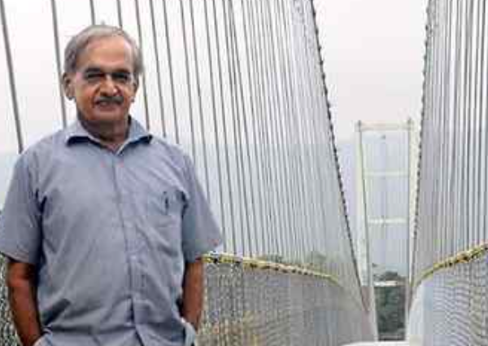

1. Girish Bharadwaj - “Bridge Man of India”: When most engineers dreamt of skyscrapers and mega infrastructure, Girish Bharadwaj chose to build simple suspension bridges connecting India’s most remote villages. Beginning with a modest footbridge across the Payaswini River in Karnataka in 1989, he went on to construct over 140 low-cost hanging bridges, transforming the lives of thousands. Known as the “Bridge Man of India”, he believed that true engineering should serve the poorest first. His bridges were not merely structures of steel and cables; they connected children to schools, patients to hospitals, and farmers to markets. Often working with local communities and minimal resources, he demonstrated that innovation is driven more by purpose than by budgets. Awarded the Padma Shri in 2017, Bharadwaj embodied the spirit of “Antyodaya” by bringing development to the last person. His life reminds us that nation-building is measured not only by monumental projects but also by the countless lives quietly transformed through selfless service. His legacy teaches that the strongest bridges are those built with compassion, innovation, and commitment to society.
   - 
2. The Vietnam Boat Tragedy: When a Holiday Turned into Heartbreak: The Vietnam Boat Tragedy. Anecdote: A group of Indian tourists left their homes in Tamil Nadu, Kerala and Andhra Pradesh for what was meant to be a joyful holiday in Vietnam. Until Friday, their phones carried cheerful updates, photographs and promises of returning home with memories and souvenirs. But when their boat capsized off Phu Quoc Island, those same phones brought news that no family was prepared to receive. Among the victims were couples, businessmen and friends whose loved ones had been eagerly awaiting their return. One traveller had told his son that he would soon be out of network as they were heading towards an island—unaware that it would be their last conversation. Homes that had waited for smiling photographs were suddenly preparing to receive coffins. The tragedy reminds us that life’s certainty often rests on the fragile edge of an uncertain moment. It also underlines the need for stronger tourist safety standards, responsible travel operators and effective emergency response mechanisms. Above all, it teaches that behind every disaster statistic lies a human story, a grieving family and a future abruptly interrupted.
   1. 
3. Democracy < Monarchy: People of Bhutan towards its King. Banjaras towards their king Maharana Pratap

