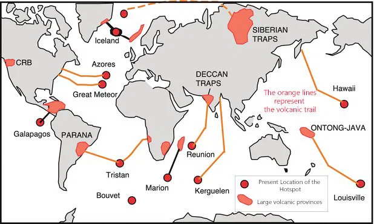

### Q1. Explain the formation of deccan trap.

**INTRO:** The Deccan Traps are a Large Igneous Province (LIP), one of the largest volcanic features on Earth, covering a vast area of peninsular India. Formed around 66 million years ago, their unique geology has profoundly shaped the region's soil, resources, and topography.

**BODY:**

1.  **Time of Formation:** The main phase of eruptions occurred at the end of the Cretaceous period, around 66 million years ago, coinciding with the Cretaceous-Paleogene extinction event that wiped out the dinosaurs.
2.  **Mechanism (Fissure Eruption):** The formation was not through explosive, conical volcanoes but through quiet fissure eruptions, where highly fluid lava flowed out from long cracks in the Earth's crust.
3.  **Hotspot Volcanism:** The most widely accepted theory attributes the eruptions to the Indian tectonic plate moving over the Réunion hotspot, a stationary plume of hot mantle material rising from deep within the Earth.
4.  **Lava Type (Basaltic):** The lava was basaltic in nature, which is low in viscosity (very fluid). This allowed it to flow over vast distances, covering hundreds of kilometers before solidifying.
5.  **Layered Structure:** The eruptions occurred in phases, with successive lava flows piling up on top of each other, creating a massive, layered, step-like (or 'trap') structure. The thickness of the traps exceeds 2,000 meters in some places.
6.  **Geographical Extent:** The Deccan Traps cover a massive area of about 500,000 sq. km, primarily in the states of Maharashtra, Gujarat, Madhya Pradesh, and Karnataka.
7.  **Impact on Climate:** The massive release of volcanic gases like sulfur dioxide and carbon dioxide during the eruptions had a significant, though debated, impact on the global climate.
8.  **Formation of Black Soil:** Over millions of years, the weathering of this basaltic rock has resulted in the formation of highly fertile black soils (Regur), which are ideal for cotton cultivation.

**CONCLUSION:** The Deccan Traps are a monumental testament to the power of intra-plate volcanism, a geological event that not only shaped the physical landscape of a subcontinent but also played a role in a global mass extinction, leaving behind a legacy of rich agricultural soils.

### Q2. Explain the formation of Himalyan mountain range.

**INTRO:** The Himalayas, the world's highest and youngest fold mountains, are a classic example of a mountain range formed by the collision of two continental tectonic plates. Their ongoing formation makes the region geologically active and has a profound influence on India's climate and river systems.

**BODY:**

1.  **Plate Tectonic Theory:** The formation is explained by the theory of Plate Tectonics, which describes the movement of the Earth's lithospheric plates.
2.  **Northward Drift of Indian Plate:** About 70 million years ago, the Indian plate, after breaking away from the Gondwana supercontinent, began a rapid northward drift towards the Eurasian plate.
3.  **The Tethys Sea:** A vast, shallow sea called the Tethys Geosyncline separated the Indian and Eurasian plates. Rivers from both landmasses deposited huge amounts of sediment into this sea for millions of years.
4.  **Continental-Continental Collision:** Around 40-50 million years ago, the Indian plate collided with the Eurasian plate. Since both are continental plates, neither could subduct under the other.
5.  **Folding and Uplift:** The immense compressional force caused the sediments of the Tethys Sea to buckle, fold, and uplift, forming the Himalayan mountain ranges.
6.  **Three Phases of Uplift:** The uplift occurred in three main phases:
    *   **Phase 1 (Great Himalayas):** The formation of the Great Himalayas (Himadri) around 25-30 million years ago.
    *   **Phase 2 (Lesser Himalayas):** The formation of the Lesser or Middle Himalayas (Himachal) around 15 million years ago.
    *   **Phase 3 (Shiwaliks):** The formation of the outer Himalayas (Shiwaliks) around 2 million years ago.
7.  **Ongoing Process:** The Indian plate is still pushing northwards at a rate of about 5 cm per year, causing the Himalayas to continue to rise and making the region highly seismic.
8.  **Syntaxial Bends:** The arcuate shape of the Himalayas is punctuated by sharp, hairpin-like bends at its western and eastern ends, known as syntaxial bends (near Nanga Parbat and Namcha Barwa).

**CONCLUSION:** The Himalayas are not static mountains but a dynamic, living geological feature. Their continuous uplift is a powerful reminder of the immense forces of plate tectonics that continue to shape our planet's surface.

### Q3. What are the economic importance of varieties of rocks found in India ?

**INTRO:** India's diverse geological history has endowed it with a wide variety of rock systems, each possessing unique mineral resources that form the bedrock of the country's industrial and economic development.

**BODY:**

1.  **Dharwar System:** These are ancient metamorphic rocks, extremely rich in metallic minerals. **Economic Importance:** They are the primary source of **iron ore, manganese, copper, and gold** (e.g., Kolar Gold Fields).
2.  **Cuddapah System:** These rocks are rich in non-metallic minerals. **Economic Importance:** They provide high-quality **limestone** (for the cement industry), **sandstone**, and asbestos.
3.  **Vindhyan System:** Known for high-quality building materials and precious stones. **Economic Importance:** Source of ornamental stones like **red sandstone** (used in Red Fort) and diamonds (from the **Panna mines**).
4.  **Gondwana System:** These sedimentary rocks are the storehouse of India's energy resources. **Economic Importance:** They contain over 98% of India's **coal** reserves, crucial for the power and steel industries.
5.  **Deccan Traps (Basaltic Rocks):** The weathering of these volcanic rocks has immense agricultural and mineral importance. **Economic Importance:** Forms fertile **black soil** (for cotton) and contains large deposits of **bauxite** (aluminum ore).
6.  **Tertiary System (Himalayas):** The rock structures in the Himalayan foothills are important for fossil fuels. **Economic Importance:** They contain significant deposits of **petroleum and natural gas** (e.g., Assam oil fields).
7.  **Alluvial Deposits (Quaternary):** These are unconsolidated sediments forming vast plains. **Economic Importance:** They create the highly fertile **Indo-Gangetic plains**, the "granary of India," supporting intensive agriculture.
8.  **Metamorphic Rocks (General):** Provide valuable building and industrial materials. **Economic Importance:** Source of **marble** (e.g., Makrana marble for Taj Mahal), **slate**, and **graphite**.

**CONCLUSION:** The distribution of India's mineral wealth and agricultural potential is directly governed by its underlying geology. A systematic understanding and sustainable exploitation of these rock systems are fundamental to the nation's economic progress.

### Q4. What is the direction of tilt of peninsular India ? What is the cause of this tilt ?

**INTRO:** The general tilt of the Peninsular Plateau of India is from the west to the east. This is clearly evidenced by the direction of flow of its major rivers and is a result of a major geological event in the subcontinent's history.

**BODY:**

*   **Direction of Tilt:**
    1.  The broad tilt of the peninsula is from **west to east**.
    2.  **Evidence from River Flow:** This is demonstrated by the fact that major peninsular rivers like the **Mahanadi, Godavari, Krishna, and Cauvery** originate in the Western Ghats and flow eastwards to drain into the Bay of Bengal.
    3.  **Exception:** The Narmada and Tapi rivers are exceptions, as they flow westwards through a rift valley.

*   **Cause of the Tilt:**
    1.  **Himalayan Uplift:** The primary cause of the tilt is linked to the formation of the Himalayas.
    2.  **Subsidence of Western Flank:** During the Tertiary period, the immense compressional force from the collision of the Indian plate with the Eurasian plate caused the western flank of the peninsula to subside.
    3.  **Formation of Western Ghats:** This subsidence resulted in the formation of the Western Ghats as a steep, fault-scarp mountain range along the west coast.
    4.  **Gentle Eastern Slope:** The eastern part of the peninsula was not affected as much and developed a gentle slope towards the east, leading to the overall west-to-east tilt of the plateau.

**CONCLUSION:** The west-to-east tilt of the Peninsular Plateau is a fundamental geomorphological feature that has dictated the drainage patterns and river basin characteristics of southern India for millions of years.

### Q5. Why east flowing rivers forms a delta where as west flowing rivers do not ? 

**INTRO:** The contrasting landforms at the mouths of the east-flowing and west-flowing rivers of Peninsular India—deltas in the east and estuaries in the west—are a direct result of the differences in their course, velocity, sediment load, and the geomorphology of the respective coastlines.

**BODY:**

*   **Why East-Flowing Rivers Form Deltas:**
    1.  **Long Course and Gentle Slope:** Rivers like the Godavari, Krishna, and Cauvery have a long course over a gentle slope, which reduces their velocity as they approach the sea.
    2.  **Large Sediment Load:** They flow through softer rocks of the eastern plateau, eroding and carrying a large volume of silt and sediment.
    3.  **Deposition at Mouth:** The low velocity at the mouth allows the river to deposit its large sediment load, forming a delta.
    4.  **Emergent Coastline:** The east coast is an emergent coastline, which is wider and has a gentler slope, providing favorable conditions for deposition and delta formation.

*   **Why West-Flowing Rivers Do Not Form Deltas (Form Estuaries):**
    1.  **Short and Swift Course:** Rivers like the Narmada, Tapi, and others originating in the Western Ghats have a short and steep course to the Arabian Sea.
    2.  **High Velocity:** The steep gradient gives them a high velocity, which does not allow for the deposition of sediment at the mouth.
    3.  **Low Sediment Load:** They flow through hard, crystalline rocks, which are not easily eroded, so they carry a much smaller sediment load.
    4.  **Formation of Estuaries:** Instead of depositing sediment, their high velocity scours the river mouth, forming deep, funnel-shaped estuaries.
    5.  **Submerged Coastline:** The west coast is a submerged coastline, which is narrow and steep, and not conducive to delta formation.

**CONCLUSION:** The presence of deltas on the east coast and estuaries on the west coast is a classic geographical outcome of the distinct geological history and physiography of the two sides of the Indian Peninsula.

### Q6. Explain the importance of Himalyas in India with respect to its geography and climate.

**INTRO:** The Himalayas, a majestic mountain range forming India's northern border, are not just a physical feature but a critical geographical and climatic determinant that has profoundly shaped the subcontinent's environment, culture, and history.

**BODY:**

*   **Climatic Importance:**
    1.  **Climatic Divide:** The Himalayas act as a massive climatic barrier, preventing the cold, dry winds from Central Asia from entering India, thus keeping the subcontinent warmer than other regions at similar latitudes.
    2.  **Monsoon Control:** They intercept the moisture-laden South-West monsoon winds, forcing them to rise and shed their moisture in the form of heavy rainfall over the Indo-Gangetic plains. Without the Himalayas, this region would have been a desert.
    3.  **Jet Stream Influence:** The Himalayas influence the path of the subtropical westerly jet stream, which plays a crucial role in the onset and withdrawal of the monsoon.

*   **Geographical Importance:**
    1.  **Source of Perennial Rivers:** The Himalayan glaciers are the source of major perennial rivers like the Ganga, Indus, and Brahmaputra, which provide water for drinking, irrigation, and hydropower.
    2.  **Fertile Plains:** The erosion of the Himalayas by these rivers has led to the deposition of fertile alluvial soil, creating the vast and productive Indo-Gangetic plains.
    3.  **Rich Biodiversity:** The diverse altitudes and climates of the Himalayas support a rich and unique biodiversity, making it a global biodiversity hotspot.
    4.  **Natural Defence Barrier:** Historically, the Himalayas have acted as a natural defence barrier, protecting India from invasions from the north.
    5.  **Tourism and Pilgrimage:** The scenic beauty and spiritual significance of the Himalayas make them a major center for tourism and pilgrimage.

**CONCLUSION:** From acting as a climatic thermostat to being the source of life-giving rivers, the Himalayas are the single most important geographical feature influencing the climate, hydrology, and overall environment of the Indian subcontinent.

### Q7. Explain the population distribution in India.

**INTRO:** The distribution of population in India is highly uneven, reflecting the strong influence of physical, socio-economic, and historical factors. The pattern is characterized by high concentrations in fertile river plains and coastal areas, and sparse populations in mountainous and arid regions.

**BODY:**

1.  **High-Density Regions (The Plains):** The Indo-Gangetic plains (UP, Bihar, West Bengal) are the most densely populated region due to their flat terrain, fertile alluvial soils, and abundant water supply, which support intensive agriculture.
2.  **High-Density Regions (Coastal Plains):** The coastal plains, especially the Malabar and Coromandel coasts, have high population densities due to favorable climate, fertile soils for rice cultivation, and opportunities in fishing and trade.
3.  **Moderate-Density Regions (Peninsular Plateau):** The Deccan Plateau has a moderate population density, as the agricultural potential is limited by less fertile soils and lower rainfall compared to the plains.
4.  **Low-Density Regions (Himalayas):** The Himalayan states (e.g., Arunachal Pradesh, Sikkim) have very low population densities due to rugged terrain, harsh climate, and limited agricultural land.
5.  **Low-Density Regions (Desert):** The Thar Desert in western Rajasthan has a sparse population due to extreme climate and lack of water.
6.  **Influence of Urbanization:** Major metropolitan cities like Delhi, Mumbai, Kolkata, and Chennai are pockets of extremely high population density due to the concentration of economic opportunities.
7.  **Historical Factors:** Areas with a long history of settled agriculture and trade, like the river valleys, have traditionally supported larger populations.
8.  **Industrial and Economic Factors:** The distribution of industries, mines, and commercial centers also acts as a major pull factor for population concentration.

**CONCLUSION:** The spatial pattern of India's population distribution is a clear geographical expression of the interplay between the opportunities and constraints presented by the natural environment and the processes of economic development.

### Q8. 
### Q9. 
### Q10. 
### Q11. 
### Q12. 
### Q13. 
### Q14. 
### Q15. 

---
### Micronotes

#### Q1. Formation of Deccan Traps
*   **Intro:** A Large Igneous Province (LIP) formed around 66 million years ago, whose geology has profoundly shaped peninsular India.
*   **Body Keywords:**
    1.  **Time:** End of Cretaceous period (~66 mya).
    2.  **Mechanism:** Quiet fissure eruptions, not conical volcanoes.
    3.  **Cause:** Réunion hotspot volcanism.
    4.  **Lava Type:** Fluid basaltic lava.
    5.  **Structure:** Layered, step-like ('trap') structure.
    6.  **Extent:** ~500,000 sq. km (Maharashtra, Gujarat etc.).
    7.  **Impact:** Climate change, formation of black soil.
*   **Conclusion:** A monumental testament to intra-plate volcanism, leaving a legacy of rich agricultural soils.

#### Q2. Formation of Himalayan Mountain Range
*   **Intro:** The world's highest and youngest fold mountains, formed by the collision of the Indian and Eurasian continental plates.
*   **Body Keywords:**
    1.  **Theory:** Plate Tectonics.
    2.  **Process:** Northward drift of Indian plate.
    3.  **Tethys Sea:** Sediments deposited in the sea between the plates.
    4.  **Collision:** Continental-continental collision (~40-50 mya).
    5.  **Folding and Uplift:** Sediments of Tethys Sea buckled and folded.
    6.  **Three Phases:** Great Himalayas -> Lesser Himalayas -> Shiwaliks.
    7.  **Ongoing Process:** Indian plate still pushing northwards, causing seismic activity.
    8.  **Syntaxial Bends:** Sharp hairpin bends at western and eastern ends.
*   **Conclusion:** A dynamic, living geological feature, a powerful reminder of the forces of plate tectonics.

#### Q3. Economic Importance of Indian Rocks
*   **Intro:** India's diverse geology has endowed it with a wide variety of rock systems, each with unique mineral resources.
*   **Body Keywords:**
    1.  **Dharwar System:** Iron ore, manganese, gold.
    2.  **Cuddapah System:** Limestone, sandstone.
    3.  **Vindhyan System:** Red sandstone, diamonds (Panna).
    4.  **Gondwana System:** Over 98% of India's coal.
    5.  **Deccan Traps:** Black soil (cotton), bauxite.
    6.  **Tertiary System (Himalayas):** Petroleum, natural gas.
    7.  **Alluvial Deposits:** Fertile Indo-Gangetic plains.
    8.  **Metamorphic Rocks:** Marble, slate.
*   **Conclusion:** The distribution of India's mineral and agricultural potential is directly governed by its underlying geology.

#### Q4. Tilt of Peninsular India
*   **Intro:** The general tilt of the Peninsular Plateau is from west to east, evidenced by the flow of its major rivers.
*   **Body Keywords:**
    1.  **Direction:** West to East.
    2.  **Evidence:** Eastward flow of Mahanadi, Godavari, Krishna, Cauvery.
    3.  **Cause:** Linked to Himalayan uplift; subsidence of the western flank of the peninsula.
    4.  **Result:** Formation of Western Ghats as a steep fault-scarp.
*   **Conclusion:** A fundamental geomorphological feature that has dictated the drainage patterns of southern India.

#### Q5. Why East-Flowing Rivers Form Deltas
*   **Intro:** The contrasting landforms (deltas in east, estuaries in west) are a result of differences in course, velocity, sediment load, and coastal geomorphology.
*   **Body Keywords:**
    1.  **East-Flowing (Deltas):** Long course, gentle slope, large sediment load, emergent coastline.
    2.  **West-Flowing (Estuaries):** Short & swift course, high velocity, low sediment load, submerged coastline.
*   **Conclusion:** A classic geographical outcome of the distinct geological history of the two sides of the Indian Peninsula.

#### Q6. Importance of Himalayas
*   **Intro:** The Himalayas are a critical geographical and climatic determinant that has profoundly shaped the subcontinent.
*   **Body Keywords:**
    1.  **Climatic:** Climatic Divide (blocks cold winds), Monsoon Control (forces rainfall), Jet Stream Influence.
    2.  **Geographical:** Source of Perennial Rivers, Fertile Plains, Rich Biodiversity, Natural Defence Barrier, Tourism.
*   **Conclusion:** The single most important geographical feature influencing the climate and hydrology of the Indian subcontinent.

#### Q7. Population Distribution in India
*   **Intro:** The distribution of population is highly uneven, reflecting the influence of physical, socio-economic, and historical factors.
*   **Body Keywords:**
    1.  **High-Density:** Indo-Gangetic plains, Coastal plains.
    2.  **Moderate-Density:** Peninsular Plateau.
    3.  **Low-Density:** Himalayas, Thar Desert.
    4.  **Influence of Urbanization:** High concentration in metropolitan cities.
*   **Conclusion:** A clear geographical expression of the interplay between environmental opportunities and economic development.