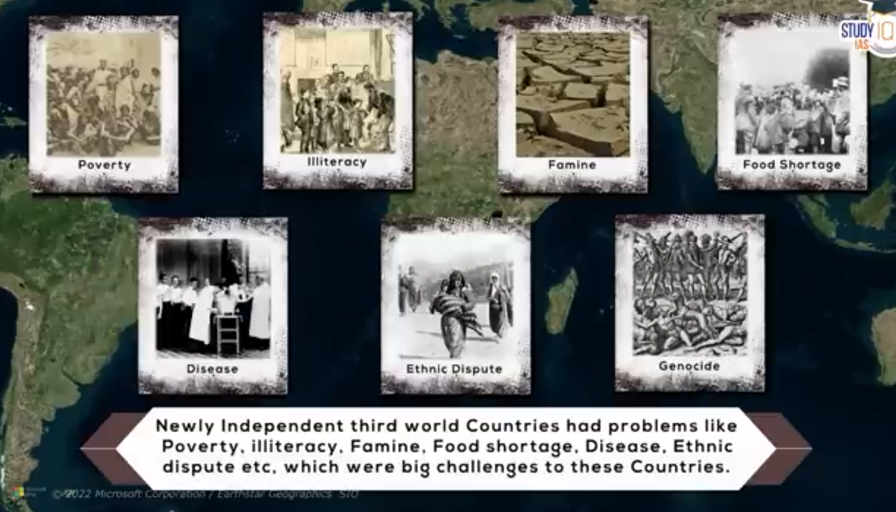

## Russian Revolution
### Q1. What were the causes of Russian Revolution ?

**INTRO:** The Russian Revolution was an explosion of popular discontent against a decadent autocracy, war exhaustion, and extreme inequality.

**BODY:**

*   **Long-Term Political & Socio-Economic Causes:**
    1.  **Tsarist Autocracy:** The absolute and inefficient rule of Tsar Nicholas II, who believed in the divine right of kings.
    2.  **Agrarian Crisis:** Widespread peasant poverty and land hunger due to the incomplete nature of the 1861 emancipation of serfs.
    3.  **Industrial Discontent:** Rapid, state-led industrialization created a small but highly concentrated and radicalized urban proletariat living in squalor.
    4.  **Rise of Revolutionary Ideas:** The spread of Marxist ideology among workers and intellectuals provided a framework for revolution.

*   **Immediate Catalysts & Triggers:**
    1.  **Russo-Japanese War (1904-05):** A humiliating military defeat that shattered the myth of Tsarist invincibility and led to the 1905 Revolution.
    2.  **Bloody Sunday (1905):** The massacre of peaceful protestors in St. Petersburg, which destroyed the Tsar's image as the "Little Father" of the people.
    3.  **The October Manifesto:** The Tsar's promise of a constitutional monarchy and a parliament (Duma), which he later undermined, creating political frustration.
    4.  **World War I:** The war caused massive casualties, food shortages, and economic collapse, acting as the final catalyst. *Fact: Over 15 million men were mobilized.*
    5.  **Influence of Rasputin:** The scandalous influence of the mystic Grigori Rasputin over the Tsarina discredited the monarchy.
    6.  **Bolshevik Leadership:** The disciplined and determined leadership of Vladimir Lenin and the Bolshevik party, with their simple slogan "Peace, Land, and Bread."

**CONCLUSION:** The revolution was the inevitable collapse of a medieval political system unable to cope with the pressures of a modern war.

### Q2. What were teh consequences of Russian Revolution ?

**INTRO:** The Russian Revolution was a world-shattering event that created the first communist state and fundamentally altered the course of 20th-century history.

**BODY:**

*   **Immediate Political & Social Consequences:**
    1.  **End of the Romanov Dynasty:** The execution of Tsar Nicholas II and his family ended three centuries of Romanov rule.
    2.  **Establishment of the Soviet Union:** The creation of the world's first socialist state, the USSR, based on Marxist-Leninist ideology.
    3.  **Russian Civil War (1918-1922):** A brutal conflict between the Bolshevik "Reds" and the anti-Bolshevik "Whites," leading to millions of deaths.
    4.  **Withdrawal from WWI:** The Bolsheviks signed the Treaty of Brest-Litovsk with Germany, taking Russia out of the First World War.

*   **Long-Term Economic & Political Consequences:**
    1.  **Nationalization of Industry:** All industries, banks, and land were nationalized and brought under state control.
    2.  **Rapid Industrialization:** Stalin's Five-Year Plans led to the rapid and brutal industrialization of the Soviet Union.
    3.  **Collectivization of Agriculture:** The forced collectivization of farms led to massive famines and the death of millions.
    4.  **Rise of a Totalitarian State:** Under Stalin, the Soviet Union became a one-party totalitarian state with a cult of personality and widespread repression.

*   **Global Consequences:**
    1.  **Global Spread of Communism:** The revolution inspired the formation of communist parties and movements around the world, leading to the Cold War.
    2.  **Formation of the Comintern:** The Communist International was formed to promote world revolution.

**CONCLUSION:** The revolution created a new global superpower and an ideological rival to capitalism, defining the geopolitical landscape for the next 70 years.

### Q3. How Russia using socialist approach developed so rapidly post Russian Revolution ?

**INTRO:** Post-revolution, Russia developed rapidly through a brutal, state-led socialist approach that prioritized heavy industry and military might over consumer goods and human rights.

**BODY:**

*   **Economic Strategy:**
    1.  **State Planning (Gosplan):** The establishment of a central planning committee that directed all economic activity through Five-Year Plans.
    2.  **Focus on Heavy Industry:** The plans prioritized the development of coal, steel, and electricity to build a strong industrial and military base.
    3.  **Collectivization of Agriculture:** The forced consolidation of individual peasant farms into large state-controlled collective farms (kolkhozes) to extract grain surplus.
    4.  **Nationalization of Resources:** The state took control of all natural resources, land, and industries, allowing for centralized allocation.
    5.  **Centralized Capital Mobilization:** The state could mobilize and direct capital on a massive scale without relying on private markets.
    6.  **Suppression of Consumption:** The production of consumer goods was deliberately suppressed to channel all resources into capital investment.

*   **Social & Political Mobilization:**
    1.  **Forced Labor:** The extensive use of forced labor, including millions of political prisoners in the Gulag, to build massive infrastructure projects.
    2.  **Mass Education and Skilling:** A massive campaign to eradicate illiteracy and train a technical workforce for the new industries.
    3.  **Elimination of Private Profit Motive:** All production was geared towards meeting state-set targets, not for private profit.
    4.  **Totalitarian Control:** The totalitarian political system under Stalin crushed all opposition and dissent, allowing for ruthless implementation of policies.

**CONCLUSION:** Russia's rapid development was a "revolution from above," achieved through immense human cost and the complete subordination of the individual to the state.

---
## Great Depression
### Q4. What were the causes of Great Depression ?

**INTRO:** The Great Depression was a catastrophic global economic collapse triggered by the 1929 Wall Street Crash, but its roots lay in the structural weaknesses of the post-WWI economy.

**BODY:**

*   **Structural Economic Weaknesses:**
    1.  **Overproduction and Under-consumption:** American industries were producing more goods than consumers could afford to buy, leading to a glut.
    2.  **Unequal Distribution of Wealth:** A vast gap between the rich and the poor meant that the majority of the population lacked purchasing power.
    3.  **Weak Banking System:** Thousands of small, unregulated banks failed, wiping out the savings of ordinary people.
    4.  **Agricultural Crisis:** Farmers were already suffering from overproduction, falling prices, and debt throughout the 1920s.

*   **Policy Failures & Triggers:**
    1.  **Stock Market Crash (1929):** The speculative bubble on Wall Street burst on "Black Tuesday," wiping out billions in wealth and shattering investor confidence.
    2.  **Protectionism (Smoot-Hawley Tariff):** The US imposed high tariffs on imported goods, leading to retaliatory tariffs from other countries and the collapse of world trade.
    3.  **War Debts and Reparations:** The cycle of US loans to Germany, German reparations to the Allies, and Allied war debt payments to the US was fragile and unsustainable.
    4.  **Adherence to the Gold Standard:** Many countries tried to maintain the gold standard, which forced them to adopt deflationary policies and worsened the downturn.
    5.  **Lack of Government Intervention:** The initial response of governments was based on classical economic theory, which advocated for minimal intervention and balanced budgets.
    6.  **Psychological Factor (Loss of Confidence):** A widespread loss of confidence led to a downward spiral of reduced spending, investment, and production.

**CONCLUSION:** The Great Depression was a perfect storm of speculative excess, structural imbalances, and poor policy decisions that plunged the world into a decade of economic misery.

### Q5. What were the consequences of Great Depression ?

**INTRO:** The Great Depression had devastating economic, social, and political consequences, leading to mass unemployment, social unrest, and the rise of extremist ideologies.

**BODY:**

*   **Economic & Social Consequences:**
    1.  **Mass Unemployment:** Millions lost their jobs, with unemployment rates reaching as high as 25% in the United States.
    2.  **Widespread Poverty and Hardship:** Led to homelessness, hunger, and the growth of shantytowns known as "Hoovervilles."
    3.  **Collapse of World Trade:** Protectionist policies led to a dramatic contraction in international trade.
    4.  **Political Instability:** The depression led to political instability and social unrest in many countries.

*   **Political & Ideological Consequences:**
    1.  **Rise of Extremism:** The economic crisis created fertile ground for the rise of fascist and militarist regimes in Germany, Italy, and Japan.
    2.  **Foundation for WWII:** The economic hardship and the rise of aggressive nationalist regimes were major contributing factors to the outbreak of the Second World War.
    3.  **Shift in Economic Theory (Keynesianism):** Led to the rise of Keynesian economics, which advocated for government intervention and deficit spending to manage the economy.
    4.  **Expansion of the Welfare State:** Governments began to take on a greater role in providing social safety nets, such as unemployment benefits and social security.
    5.  **The New Deal:** In the US, President Franklin D. Roosevelt's New Deal programs expanded the role of the federal government in the economy.
    6.  **End of Laissez-faire:** It marked the end of the era of unregulated, laissez-faire capitalism.

**CONCLUSION:** The Great Depression was a transformative crisis that not only caused immense human suffering but also fundamentally reshaped the role of the state in the economy.

### Q5. What were the steps taken by Franklin D. Roosevelt to overcome Great Depression ?

**INTRO:** Franklin D. Roosevelt's "New Deal" was a series of ambitious programs and reforms aimed at providing relief, recovery, and reform to overcome the Great Depression.

**BODY:**

*   **Relief & Recovery Measures:**
    1.  **The Three R's:** The New Deal was based on the principles of Relief (for the unemployed), Recovery (of the economy), and Reform (of the financial system).
    2.  **Emergency Banking Act:** A "bank holiday" was declared to close all banks and only allow solvent ones to reopen, restoring confidence in the banking system.
    3.  **Civilian Conservation Corps (CCC):** A public work relief program that employed young men in environmental projects.
    4.  **Works Progress Administration (WPA):** A large-scale public works program that employed millions in building infrastructure and in arts projects.
    5.  **Agricultural Adjustment Act (AAA):** Paid farmers to reduce production in order to raise crop prices.
    6.  **Tennessee Valley Authority (TVA):** A massive federal project to build dams for flood control and electricity generation in a poor region.

*   **Reform Measures:**
    1.  **Federal Deposit Insurance Corporation (FDIC):** Created to insure bank deposits, preventing future bank runs.
    2.  **Securities and Exchange Commission (SEC):** Created to regulate the stock market and prevent fraud.
    3.  **Social Security Act:** Established a national system of old-age pensions, unemployment insurance, and aid for dependent children.
    4.  **Abandonment of the Gold Standard:** Taking the US off the gold standard allowed for more flexible monetary policy to combat deflation.

**CONCLUSION:** The New Deal fundamentally changed the role of the American government, establishing the principle that the state has a responsibility to ensure the economic well-being of its citizens.

--- 
## World War II
### Q6. Elaborate the sanctions posed on Germany post first World War.

**INTRO:** The Treaty of Versailles (1919) imposed a series of harsh and humiliating sanctions on Germany, which were intended to cripple it but instead fueled deep resentment and the rise of Nazism.

**BODY:**

*   **Political & Moral Sanctions:**
    1.  **War Guilt Clause (Article 231):** Germany was forced to accept sole responsibility for starting the war, a source of immense national humiliation.
    2.  **"Diktat" (Dictated Peace):** The treaty was seen as a "diktat" because Germany was not allowed to participate in the negotiations and was forced to sign it.

*   **Economic & Territorial Sanctions:**
    1.  **Massive Reparations:** Germany was required to pay crippling financial reparations to the Allied powers, totaling 132 billion gold marks.
    2.  **Territorial Losses:** Germany lost 13% of its European territory, including Alsace-Lorraine to France and large areas to Poland.
    3.  **Loss of Colonies:** All of Germany's overseas colonies in Africa and Asia were confiscated and given to the Allies as mandates.
    4.  **Saar Basin:** The coal-rich Saar region was placed under League of Nations control for 15 years.
    5.  **Danzig and the Polish Corridor:** The German city of Danzig was made a free city, and the "Polish Corridor" separated East Prussia from the rest of Germany.

*   **Military Sanctions:**
    1.  **Military Restrictions:** The German army was limited to 100,000 men, the navy was severely restricted, and it was forbidden from having an air force, tanks, or submarines.
    2.  **Rhineland Demilitarization:** The Rhineland, a key industrial area, was to be permanently demilitarized.
    3.  **Anschluss Forbidden:** The unification of Germany and Austria was explicitly forbidden.

**CONCLUSION:** The Treaty of Versailles was a punitive peace that failed to reconcile Germany and instead created the economic and psychological conditions for the rise of Hitler and the Second World War.

### Q7. Discuss how Hitler came into power psot first World War.

**INTRO:** Adolf Hitler's rise to power was a result of his masterful exploitation of Germany's post-war humiliation, economic despair, and political instability.

**BODY:**

*   **Exploitation of National Grievances:**
    1.  **Humiliation of the Treaty of Versailles:** Hitler skillfully used the widespread resentment against the "diktat" of Versailles as a powerful nationalist rallying cry.
    2.  **The Great Depression:** The economic collapse and mass unemployment of the early 1930s created a climate of desperation and made people receptive to radical solutions.
    3.  **Weakness of the Weimar Republic:** The democratic government was seen as weak, ineffective, and associated with the shame of the Versailles treaty.

*   **Ideological & Propaganda Tools:**
    1.  **Propaganda and Oratory:** Hitler was a charismatic orator who used mass rallies, radio, and propaganda to spread his message and create a cult of personality. *Personality: Joseph Goebbels was his propaganda minister.*
    2.  **The "Stab-in-the-Back" Myth:** The Nazis promoted the myth that Germany had not lost the war but had been betrayed by Jews, communists, and politicians at home.
    3.  **Anti-Semitism:** Hitler used the Jews as a scapegoat for all of Germany's problems, tapping into a long history of anti-Semitism.
    4.  **Fear of Communism:** The middle and upper classes, fearing a communist revolution, saw the Nazis as a bulwark against the left.

*   **Political Maneuvering & Consolidation of Power:**
    1.  **Use of Violence and Intimidation:** The Nazi stormtroopers (the SA) used violence to intimidate political opponents and create an atmosphere of chaos.
    2.  **Political Intrigue:** Hitler was appointed Chancellor in 1933 through a backroom political deal by conservative politicians who thought they could control him.
    3.  **The Reichstag Fire:** The burning of the parliament building was used as a pretext to suspend civil liberties and eliminate political opposition.

**CONCLUSION:** Hitler did not seize power in a coup; he was given it by a political establishment that underestimated his ambition and a populace desperate for a savior.

### Q8. Discuss how Hitler's ambitions resulted in second world war ?

**INTRO:** The Second World War was fundamentally Hitler's war, a direct result of his expansionist and racist ambitions outlined in his book, 'Mein Kampf'.

**BODY:**

*   **Core Ideological Ambitions:**
    1.  **Overturning the Treaty of Versailles:** Hitler's primary ambition was to destroy the "diktat" of Versailles and restore Germany's national pride and military power.
    2.  **Lebensraum (Living Space):** He believed that the German "master race" needed more living space, which was to be acquired by conquering Eastern Europe and enslaving its Slavic population.
    3.  **Creation of a "Greater Germany":** He aimed to unite all ethnic Germans in Europe into a single, powerful Reich.

*   **Aggressive Foreign Policy Steps:**
    1.  **Rearmament:** He began a massive and secret rearmament program in defiance of the Versailles treaty.
    2.  **Remilitarization of the Rhineland (1936):** His first major gamble, marching troops into the demilitarized Rhineland, which the Allies failed to challenge.
    3.  **Anschluss with Austria (1938):** The forced unification of Germany and Austria, another violation of the treaty.
    4.  **The Sudetenland Crisis (1938):** He demanded the German-speaking Sudetenland region of Czechoslovakia, leading to the Munich Agreement where Britain and France appeased him.
    5.  **Invasion of Czechoslovakia (1939):** His subsequent invasion of the rest of Czechoslovakia proved that his ambitions went beyond just uniting Germans and that he could not be trusted.
    6.  **The Nazi-Soviet Pact (1939):** A cynical non-aggression pact with his ideological enemy, Stalin, to avoid a two-front war and secretly divide Poland.
    7.  **Invasion of Poland (September 1, 1939):** His invasion of Poland was the final act of aggression that forced Britain and France to declare war, starting WWII.

**CONCLUSION:** Hitler's ambitions were not limited; they were a blueprint for racial domination and territorial conquest that made a major war in Europe inevitable.

### Q9. What are the key characteristics of fascism ?

**INTRO:** Fascism is a far-right, authoritarian political ideology characterized by extreme nationalism, a dictatorial leader, and the forcible suppression of opposition.

**BODY:**

*   **Political & Ideological Characteristics:**
    1.  **Extreme Nationalism:** An intense and aggressive form of nationalism that glorifies the nation-state above all else.
    2.  **Totalitarianism:** The state seeks to control every aspect of public and private life.
    3.  **Cult of the Leader (Führerprinzip):** A belief in a single, charismatic leader with dictatorial powers who embodies the will of the nation. *Example: Mussolini in Italy, Hitler in Germany.*
    4.  **Anti-Democratic:** A rejection of liberal democracy, individual rights, and parliamentary government.
    5.  **Anti-Communist:** A deep-seated hostility towards communism and socialism.

*   **Methods & Actions:**
    1.  **Militarism and Imperialism:** A glorification of war, military values, and the belief in imperial expansion.
    2.  **Use of Violence and Terror:** The use of state-sponsored violence and paramilitary groups to crush dissent and opposition.
    3.  **Propaganda and Censorship:** The state controls all media and uses propaganda to create a cult of personality and mobilize the masses.
    4.  **Corporatism:** An economic system where the state controls the economy by mediating between labor and capital.
    5.  **Racism and Scapegoating:** Often based on a belief in racial purity and the use of a minority group (like the Jews) as a scapegoat for national problems.

**CONCLUSION:** Fascism is a political religion that seeks to forge national unity through force, propaganda, and the complete subordination of the individual to the state.

### Q10. How Great Depression was foundational cause of World War II ?

**INTRO:** The Great Depression was a foundational cause of WWII because the economic misery it created led to the rise of aggressive, expansionist regimes in Germany and Japan.

**BODY:**

*   **Rise of Aggressive Regimes:**
    1.  **Rise of Nazism in Germany:** The mass unemployment and economic despair of the early 1930s made the German people receptive to Hitler's radical promises and scapegoating of the Jews.
    2.  **Rise of Militarism in Japan:** The collapse of world trade and the loss of export markets for its silk led the Japanese military to believe that imperial expansion was the only way to secure resources.
    3.  **Search for "Autarky":** The collapse of global trade led aggressive regimes to seek economic self-sufficiency (autarky) through territorial conquest.
    4.  **Social Unrest:** The Depression caused widespread social unrest and fear of communist revolutions, which made the middle classes in countries like Germany more willing to support fascist parties.

*   **Weakening of International Order:**
    1.  **Weakened Democracies:** The Depression weakened the resolve of the Western democracies (Britain, France, USA), making them more inward-looking and less willing to confront aggression.
    2.  **Policy of Appeasement:** The economic problems at home made Britain and France more inclined to appease Hitler, hoping to avoid a costly war.
    3.  **Breakdown of International Cooperation:** The economic crisis led to a rise in protectionism and "beggar-thy-neighbor" policies, destroying the spirit of international cooperation.
    4.  **Failure of the League of Nations:** The economic crisis undermined the League's ability to respond to acts of aggression, as member states were preoccupied with domestic problems.
    5.  **American Isolationism:** The severe economic problems at home reinforced the policy of isolationism in the United States, making it reluctant to get involved in global conflicts.
    6.  **Link to Versailles Treaty:** The Depression made it impossible for Germany to pay its war reparations, further fueling resentment against the Versailles Treaty.

**CONCLUSION:** The Great Depression created the desperate political and economic environment in which the seeds of the Second World War could take root and flourish.

### Q11. How Treaty of Versailles was foundational cause of World War II ?

**INTRO:** The Treaty of Versailles, intended to create a lasting peace, instead became a foundational cause of WWII by imposing a harsh and humiliating "diktat" on Germany.

**BODY:**

*   **Direct German Grievances:**
    1.  **National Humiliation (War Guilt Clause):** Article 231, the "war guilt" clause, forced Germany to accept sole blame for the war, creating deep and lasting national resentment.
    2.  **Crippling Reparations:** The massive financial reparations destroyed the German economy, leading to hyperinflation and economic instability in the 1920s.
    3.  **Territorial Losses:** The loss of territories like Alsace-Lorraine and the creation of the "Polish Corridor" were seen as unjust and fueled a desire for revenge.
    4.  **Military Restrictions:** The severe limitations on the German military were seen as a national disgrace and were openly defied by Hitler.
    5.  **"Diktat" (Dictated Peace):** The fact that Germany was not allowed to negotiate the terms of the treaty made it seem illegitimate in the eyes of the German people.

*   **Indirect Consequences:**
    1.  **Rise of Hitler:** The treaty's harshness was the central theme of Hitler's propaganda, and his promise to destroy it was a key reason for his rise to power.
    2.  **Weakened Weimar Republic:** The democratic Weimar government was permanently associated with the shame of signing the treaty, undermining its legitimacy.
    3.  **Policy of Appeasement:** The guilt felt by some in Britain over the harshness of the treaty made them more inclined to appease Hitler's early demands.
    4.  **Creation of New, Unstable States:** The treaty created new, ethnically mixed states in Eastern Europe that were weak and vulnerable to German aggression.
    5.  **Failure to Create a Lasting Peace:** The treaty was punitive enough to anger Germany but not harsh enough to permanently cripple it, creating a "20-year truce" rather than a lasting peace.

**CONCLUSION:** The Treaty of Versailles was a "victor's peace" that failed to address the root causes of the first war and instead created the grievances that led directly to the second.

### Q12. What were causes of World War 2 ?

**INTRO:** The Second World War was a result of the failure of the post-WWI settlement, the rise of aggressive expansionist powers, and the inability of the Western democracies to stop them.

**BODY:**

*   **Legacy of WWI & Rise of Aggressive Powers:**
    1.  **Treaty of Versailles:** The harsh terms imposed on Germany created a deep sense of national humiliation and a desire for revenge.
    2.  **Rise of Fascism and Nazism:** The aggressive, militaristic, and expansionist ideologies of Mussolini's Italy and Hitler's Germany.
    3.  **Hitler's Ambitions:** Hitler's desire for "Lebensraum" (living space) in Eastern Europe and his goal of creating a "Greater Germany."
    4.  **Japanese Expansionism:** Japan's invasion of Manchuria (1931) and China (1937) in its quest to create a "Greater East Asia Co-Prosperity Sphere."

*   **Failure of International System & Diplomacy:**
    1.  **Policy of Appeasement:** The policy of Britain and France to make concessions to Hitler in the hope of avoiding war. *Example: The Munich Agreement of 1938.*
    2.  **Failure of the League of Nations:** The League's inability to take decisive action against aggression in Manchuria and Abyssinia destroyed its credibility.
    3.  **The Great Depression:** The global economic crisis led to the rise of extremist regimes and weakened the resolve of the democracies.
    4.  **American Isolationism:** The United States' policy of non-involvement in European affairs removed a major deterrent to aggression.
    5.  **The Nazi-Soviet Pact (1939):** The non-aggression pact between Hitler and Stalin that gave Hitler a green light to invade Poland.
    6.  **Invasion of Poland (September 1, 1939):** The immediate trigger of the war in Europe, as Britain and France finally declared war on Germany.

**CONCLUSION:** WWII was a culmination of unresolved grievances from the first war and a catastrophic failure of collective security in the face of totalitarian aggression.

### Q13. How industrial revolution and structural employment changes led to mass scale global unemployment between the two world wars ?

**INTRO:** The period between the two world wars saw mass unemployment, a crisis rooted in the structural changes brought by the Industrial Revolution and exacerbated by the economic dislocations of WWI.

**BODY:**

*   **Structural Economic Changes:**
    1.  **Technological Unemployment:** The Second Industrial Revolution (electricity, assembly lines) led to rapid increases in productivity, meaning fewer workers were needed to produce the same amount of goods.
    2.  **Decline of Traditional Industries:** Older industries like coal mining and textiles faced decline due to new technologies and competition, leading to structural unemployment in regions dependent on them.
    3.  **Agricultural Mechanization:** The mechanization of agriculture displaced millions of farm workers, who then migrated to cities in search of jobs that did not exist.
    4.  **Skill Mismatch:** The new industries required new skills, and there was a mismatch between the skills of the unemployed and the needs of the economy.

*   **Post-WWI & Great Depression Shocks:**
    1.  **Post-WWI Demobilization:** Millions of soldiers returned from the war to find that their old jobs had disappeared or been automated.
    2.  **Collapse of World Trade:** The Great Depression and the rise of protectionism led to a collapse in global demand, causing factories to shut down.
    3.  **Wage Rigidity:** In some countries, strong trade unions and social policies kept wages high, which some economists argue made businesses reluctant to hire new workers.
    4.  **Lack of a Social Safety Net:** In the early part of the period, there were inadequate systems of unemployment benefits to support the jobless and maintain consumption.
    5.  **End of Mass Migration:** The United States, which had been a major destination for unemployed Europeans, imposed strict immigration quotas in the 1920s.
    6.  **Failure of Classical Economics:** Governments, following classical economic theory, often tried to balance budgets during the downturn, which worsened unemployment.

**CONCLUSION:** The mass unemployment of the interwar period was a structural crisis caused by the inability of the capitalist system to adapt to rapid technological change and the economic shock of a major war.

### Q14. Describe in brief, the course of second world war.

**INTRO:** The Second World War (1939-1945) was a total global conflict fought between the Axis and Allied powers, marked by rapid blitzkrieg, brutal occupation, and the dawn of the atomic age.

**BODY:**

*   **Phase 1: Axis Dominance (1939-1942):**
    1.  **Blitzkrieg (1939-40):** Germany's "lightning war" tactics led to the rapid conquest of Poland, Denmark, Norway, the Netherlands, Belgium, and France.
    2.  **Battle of Britain (1940):** A major air campaign where the British Royal Air Force successfully defended the UK from German invasion.
    3.  **Operation Barbarossa (1941):** Hitler's massive invasion of the Soviet Union, which opened the vast and brutal Eastern Front.
    4.  **Pearl Harbor (December 7, 1941):** The surprise Japanese attack on the US naval base at Pearl Harbor, which brought the United States into the war.

*   **Phase 2: The Turning Points (1942-1944):**
    1.  **Battle of Midway (1942):** A decisive naval battle in the Pacific where the US Navy crippled the Japanese fleet, turning the tide of the war in the Pacific.
    2.  **Battle of Stalingrad (1942-43):** A major turning point on the Eastern Front, where the Soviet army encircled and destroyed the German Sixth Army.
    3.  **D-Day (June 6, 1944):** The massive Allied invasion of Normandy, which opened a second front in Western Europe.

*   **Phase 3: Allied Victory & The End of the War (1944-1945):**
    1.  **Island Hopping:** The US strategy in the Pacific of bypassing heavily fortified Japanese islands and instead concentrating on strategically important ones.
    2.  **The Holocaust:** The systematic, state-sponsored genocide of six million Jews by the Nazi regime became fully apparent as Allied forces advanced.
    3.  **The Atomic Bombs (August 1945):** The United States dropped atomic bombs on the cities of Hiroshima and Nagasaki, leading to Japan's surrender and the end of the war.

**CONCLUSION:** WWII was the deadliest conflict in human history, a global struggle against totalitarianism that ended with the defeat of the Axis powers and the beginning of the nuclear age.

### Q15. What were the impacts of second world war ?

**INTRO:** The Second World War was a cataclysmic event that reshaped the global political, economic, and social order, leading to the Cold War and the end of European colonial empires.

**BODY:**

*   **Geopolitical & Institutional Impacts:**
    1.  **The Cold War:** The war led to the emergence of two superpowers, the USA and the USSR, and a bipolar world divided by ideological conflict.
    2.  **Formation of the United Nations:** The failure of the League of Nations led to the creation of the UN in 1945 to maintain international peace and security.
    3.  **Decolonization:** The war weakened the European colonial powers and strengthened anti-colonial movements, leading to the rapid decolonization of Asia and Africa.
    4.  **Division of Germany and Europe:** Germany was divided into East and West, and Europe was divided by an "Iron Curtain" between the communist East and the capitalist West.
    5.  **Rise of the United States:** The US emerged from the war as the world's dominant economic and military power.

*   **Human & Social Impacts:**
    1.  **Massive Human Cost:** The war resulted in an estimated 70-85 million deaths, including the six million Jews killed in the Holocaust.
    2.  **The Nuclear Age:** The use of atomic bombs ushered in the nuclear age and the constant threat of nuclear annihilation.
    3.  **Economic Recovery and the Bretton Woods System:** The war led to the creation of a new international economic order under the Bretton Woods system (IMF, World Bank).
    4.  **Creation of Israel:** The Holocaust provided a powerful impetus for the creation of the state of Israel in 1948.
    5.  **Human Rights Movement:** The horrors of the war led to a new focus on international human rights, culminating in the Universal Declaration of Human Rights.

**CONCLUSION:** The Second World War was a transformative global conflict that destroyed the old world order and created the geopolitical and institutional framework of the late 20th century.

---
## UNO
### Q16. What were the causes for formation of United Nations ?

**INTRO:** The United Nations was forged in the ashes of the Second World War, born from a collective desire to prevent a third global conflict and build a more peaceful and cooperative world order.

**BODY:**

*   **Lessons from Past Failures:**
    1.  **Failure of the League of Nations:** The inability of the League to prevent WWII demonstrated the need for a more effective international organization with stronger enforcement mechanisms.
    2.  **Horrors of WWII:** The unprecedented death and destruction of the war created a powerful global consensus that such a catastrophe should never happen again.
    3.  **The Holocaust:** The genocide of the Jews highlighted the need for an international framework to protect human rights.
    4.  **Need for Economic Cooperation:** The Great Depression showed that economic instability could lead to war, creating a need for institutions to promote global economic cooperation (IMF, World Bank).

*   **Wartime Diplomacy & New Realities:**
    1.  **The Atlantic Charter (1941):** A joint declaration by Roosevelt and Churchill that laid out a vision for a post-war world based on self-determination, free trade, and collective security.
    2.  **The Threat of Nuclear Weapons:** The dawn of the nuclear age made international cooperation and conflict prevention a matter of human survival.
    3.  **Desire for Collective Security:** The belief that peace could only be maintained if all nations worked together to deter and punish aggression.
    4.  **Promotion of Human Rights:** A growing recognition that the protection of individual human rights was essential for international peace.
    5.  **Big Power Consensus:** The wartime alliance between the major Allied powers (USA, USSR, UK, China) provided the political will to create a new organization.
    6.  **Dumbarton Oaks and Yalta Conferences:** A series of conferences where the structure and principles of the new organization were negotiated.

**CONCLUSION:** The UN was founded on the hard-won lesson of WWII: that humanity's survival depends on its ability to choose cooperation over conflict.

### Q17. Describe the success of UNO.

**INTRO:** While often criticized for its failures, the United Nations has had numerous significant successes in preventing conflict, promoting development, and advancing human rights.

**BODY:**

*   **Peace & Security:**
    1.  **Prevention of a Third World War:** The UN has provided a crucial forum for dialogue between the major powers, helping to manage the tensions of the Cold War and prevent a direct superpower conflict.
    2.  **Peacekeeping Operations:** UN peacekeepers have been deployed in dozens of conflicts around the world to monitor ceasefires, protect civilians, and facilitate peace processes.
    3.  **Decolonization:** The UN played a key role in supporting the process of decolonization and the self-determination of peoples in Asia and Africa.

*   **Humanitarian & Social Development:**
    1.  **Humanitarian Assistance:** UN agencies like the World Food Programme (WFP) and UNICEF provide life-saving assistance to millions affected by famine, war, and natural disasters.
    2.  **Global Health:** The World Health Organization (WHO) has led successful global campaigns to eradicate diseases like smallpox and combat pandemics.
    3.  **Sustainable Development:** The Millennium Development Goals (MDGs) and Sustainable Development Goals (SDGs) have provided a global framework for poverty reduction and sustainable development.
    4.  **Refugee Protection:** The UNHCR provides protection and assistance to millions of refugees and displaced persons worldwide.

*   **Norms & Law:**
    1.  **Human Rights:** The Universal Declaration of Human Rights and subsequent treaties have created a global framework for the protection of human rights.
    2.  **Environmental Protection:** The UN has been at the forefront of global efforts to address environmental challenges like climate change and ozone depletion.
    3.  **International Law:** The International Court of Justice (ICJ) and other tribunals have helped to develop and enforce international law.

**CONCLUSION:** Despite its limitations, the UN has been an indispensable force for peace, development, and human dignity in a complex and often divided world.

### Q18. What are the areas where UNO has failed ?

**INTRO:** The United Nations has often failed to live up to its founding ideals, particularly in its primary mission of preventing conflict, due to the structural limitations of the Security Council and the self-interest of its powerful members.

**BODY:**

*   **Failures in Peace & Security:**
    1.  **Failure to Prevent Genocides:** The UN failed to take decisive action to prevent genocides in Rwanda (1994) and Srebrenica (1995).
    2.  **Paralysis of the Security Council:** The veto power of the five permanent members (P5) has often paralyzed the Security Council and prevented action in major crises. *Example: The Syrian civil war.*
    3.  **Inability to Enforce Resolutions:** The UN often lacks the power to enforce its own resolutions against powerful states.
    4.  **Peacekeeping Failures:** Some UN peacekeeping missions have been criticized for failing to protect civilians or for being implicated in scandals.
    5.  **Nuclear Disarmament:** The UN has failed to achieve its goal of global nuclear disarmament.

*   **Institutional & Structural Failures:**
    1.  **Slow Pace of Security Council Reform:** The Security Council is seen as anachronistic and unrepresentative of the current global power distribution, but reforms have been blocked by the P5.
    2.  **Bureaucracy and Inefficiency:** The UN is often criticized for being a large, slow, and inefficient bureaucracy.
    3.  **Funding Issues:** The UN is often underfunded and dependent on the contributions of a few wealthy countries.
    4.  **Failure to Address Root Causes of Conflict:** The UN often deals with the symptoms of conflict rather than its underlying political and economic causes.
    5.  **Double Standards:** The UN is often accused of applying double standards, taking strong action against weak states while being unable to act against powerful ones.

**CONCLUSION:** The UN's failures highlight the persistent tension between the ideal of global governance and the reality of national sovereignty and power politics.

---
## Decolonization
### Q19. What were the causes of Decolonization ?

**INTRO:** Decolonization was the rapid and widespread collapse of European colonial empires after WWII, driven by the rise of nationalist movements and a changed global power structure.

**BODY:**

*   **Internal Factors (Within Colonies):**
    1.  **Rise of Nationalism:** The growth of powerful, organized nationalist movements in the colonies that demanded independence. *Example: The Indian National Congress.*
    2.  **Role of Educated Elites:** Western-educated elites in the colonies used the language of liberty and democracy to argue for their own independence.
    3.  **Armed Resistance:** In some colonies, armed liberation struggles made the cost of maintaining colonial rule too high. *Example: The Algerian War of Independence.*

*   **External Factors (Global Changes):**
    1.  **Weakening of Colonial Powers:** WWII exhausted the European colonial powers (Britain, France) economically and militarily, making it difficult for them to hold on to their empires.
    2.  **The Atlantic Charter:** The wartime declaration by Roosevelt and Churchill that affirmed the right of all peoples to choose their own form of government.
    3.  **The Cold War:** The two new superpowers, the USA and the USSR, were both ideologically opposed to colonialism and competed for influence in the newly independent nations.
    4.  **The United Nations:** The UN Charter enshrined the principle of self-determination, providing a platform for anti-colonial movements.
    5.  **Changing Global Opinion:** There was a growing international consensus that colonialism was morally wrong and anachronistic.
    6.  **Economic Costs of Empire:** The economic benefits of empire were declining, while the costs of administration and suppressing revolts were rising.
    7.  **Demonstration Effect:** The independence of one colony (like India) inspired and accelerated the independence movements in others.

**CONCLUSION:** Decolonization was a global political tsunami caused by the irresistible force of nationalism meeting the immovable object of a weakened and delegitimized colonialism.

### Q20. Describe in brief, the decolonization of Africa.

**INTRO:** The decolonization of Africa was a rapid and often turbulent process in the 1950s and 60s, as nationalist movements swept across the continent, ending a century of European rule.

**BODY:**

*   **Early Phase & Key Moments:**
    1.  **North Africa:** The process began in North Africa with the independence of Libya, Morocco, and Tunisia, and the brutal Algerian War of Independence against France.
    2.  **Ghana's Independence (1957):** The independence of Ghana, led by Kwame Nkrumah, was a pivotal moment that inspired other sub-Saharan African colonies.
    3.  **The "Year of Africa" (1960):** Seventeen African nations gained independence in this single year, marking the high point of the decolonization process.

*   **Methods & Challenges:**
    1.  **Role of Pan-Africanism:** The ideology of Pan-Africanism, which promoted the unity of all African peoples, was a powerful force in the independence movements.
    2.  **Peaceful vs. Violent Transitions:** Some colonies, like Ghana, achieved independence through peaceful political negotiation, while others, like Algeria and Kenya (Mau Mau Rebellion), involved violent liberation struggles.
    3.  **Settler Colonies:** The process was most difficult and violent in settler colonies where a large white population resisted majority rule. *Example: Rhodesia (Zimbabwe) and South Africa (Apartheid).*
    4.  **The Congo Crisis:** The hasty decolonization of the Belgian Congo led to a major political crisis and civil war, becoming a proxy conflict in the Cold War.
    5.  **Portuguese Colonies:** The last to be decolonized were the Portuguese colonies of Angola and Mozambique, which only gained independence after a revolution in Portugal in 1974.

*   **Legacy:**
    1.  **The Organization of African Unity (OAU):** Formed in 1963 to promote unity and cooperation among the newly independent African states.
    2.  **Legacy of Artificial Borders:** The newly independent nations inherited the arbitrary borders drawn by the colonial powers, which has been a major source of post-colonial conflict.

**CONCLUSION:** The decolonization of Africa was a moment of great hope and liberation, but the newly independent nations faced immense challenges of nation-building and development.

### Q21. Describe in brief, the decolonization of South East Asia.

**INTRO:** The decolonization of Southeast Asia was a complex process shaped by the Japanese occupation during WWII, the rise of communist movements, and the Cold War.

**BODY:**

*   **Impact of WWII & Early Independence:**
    1.  **Japanese Occupation:** The Japanese invasion shattered the myth of European invincibility and, in some cases, armed and trained local nationalist groups.
    2.  **The Philippines (1946):** The first to gain independence, granted by the United States.
    3.  **India and Burma (1947-48):** The independence of British India and Burma marked the beginning of the end of the British Empire in Asia.
    4.  **Indonesia (1949):** Achieved independence after a four-year armed struggle against the Dutch, led by Sukarno.

*   **Cold War & Communist Influence:**
    1.  **Indochina (Vietnam, Laos, Cambodia):** The French attempt to re-establish control led to the First Indochina War and their defeat at Dien Bien Phu (1954).
    2.  **The Vietnam War:** The decolonization of Vietnam became entangled in the Cold War, leading to the division of the country and the long and brutal Vietnam War.
    3.  **Malaya (1957):** Gained independence from Britain after a long counter-insurgency campaign against communist guerrillas known as the "Malayan Emergency."
    4.  **Role of Communism:** Communist parties played a major role in the anti-colonial struggles in many countries, particularly Vietnam and Malaya.
    5.  **The Domino Theory:** The US involvement in the region was driven by the "domino theory," the fear that if one country fell to communism, others would follow.
    6.  **Singapore:** Became independent after separating from the Federation of Malaysia in 1965.

**CONCLUSION:** The decolonization of Southeast Asia was a protracted and often violent process, deeply influenced by the ideological and military conflicts of the Cold War.

### Q22. What were the challenges faced by newly independent countries post decolonization ?

**INTRO:** For the newly independent nations of Asia and Africa, decolonization was not an end but a beginning, marking the start of a long and difficult struggle against the legacies of colonialism.

**BODY:**

*   **Political & Institutional Challenges:**
    1.  **Nation-Building and National Integration:** The primary challenge was to forge a unified national identity out of diverse ethnic, linguistic, and religious groups, often within artificial colonial borders.
    2.  **Political Instability:** Many new nations lacked democratic traditions and strong institutions, leading to frequent coups, civil wars, and authoritarian rule.
    3.  **Border Disputes:** The arbitrary borders drawn by the colonial powers led to numerous inter-state conflicts.
    4.  **Lack of Skilled Manpower:** A shortage of trained administrators, engineers, and doctors to run the new states.

*   **Economic & Social Challenges:**
    1.  **Economic Underdevelopment:** They inherited dependent, undiversified economies focused on exporting raw materials, with little industry and infrastructure.
    2.  **Poverty and Inequality:** Widespread poverty, illiteracy, and poor health were major challenges.
    3.  **Social Dislocation:** The challenge of balancing tradition and modernity, and dealing with the social changes brought by colonialism.

*   **External Challenges:**
    1.  **The Cold War:** The newly independent nations became a battleground for the two superpowers, the USA and the USSR, who often fueled local conflicts.
    2.  **Neo-colonialism:** Even after political independence, many countries remained economically dependent on their former colonial rulers.
    3.  **Debt Crisis:** Many countries became heavily indebted to international financial institutions like the IMF and World Bank.

**CONCLUSION:** The path to post-colonial nationhood was fraught with immense challenges, as these new states struggled to overcome the deep-seated structural problems left behind by centuries of colonial rule.

---
### Micronotes

#### Q1. Causes of Russian Revolution
*   **Intro:** An explosion of discontent against autocracy, war exhaustion, and extreme inequality.
*   **Keywords:**
    1.  **Long-Term Political & Socio-Economic Causes:**
        1.  Tsarist Autocracy
        2.  Agrarian Crisis
        3.  Industrial Discontent
        4.  Rise of Revolutionary Ideas
    2.  **Immediate Catalysts & Triggers:**
        1.  Russo-Japanese War (1904-05)
        2.  Bloody Sunday (1905)
        3.  The October Manifesto
        4.  World War I
        5.  Influence of Rasputin
        6.  Bolshevik Leadership
*   **Conclusion:** The inevitable collapse of a medieval political system unable to cope with modern pressures.

#### Q2. Consequences of Russian Revolution
*   **Intro:** A world-shattering event that created the first communist state and altered 20th-century history.
*   **Keywords:**
    1.  **Immediate Political & Social Consequences:**
        1.  End of the Romanov Dynasty
        2.  Establishment of the Soviet Union
        3.  Russian Civil War
        4.  Withdrawal from WWI
    2.  **Long-Term Economic & Political Consequences:**
        1.  Nationalization of Industry
        2.  Rapid Industrialization
        3.  Collectivization of Agriculture
        4.  Rise of a Totalitarian State
    3.  **Global Consequences:**
        1.  Global Spread of Communism
        2.  Formation of the Comintern
*   **Conclusion:** Created a new superpower and ideological rival to capitalism, defining the geopolitical landscape for 70 years.

#### Q3. Rapid Soviet Development
*   **Intro:** Achieved through a brutal, state-led socialist approach prioritizing heavy industry over human rights.
*   **Keywords:**
    1.  **Economic Strategy:**
        1.  State Planning (Gosplan)
        2.  Focus on Heavy Industry
        3.  Collectivization of Agriculture
        4.  Nationalization of Resources
        5.  Centralized Capital Mobilization
        6.  Suppression of Consumption
    2.  **Social & Political Mobilization:**
        1.  Forced Labor (Gulag)
        2.  Mass Education and Skilling
        3.  Elimination of Private Profit Motive
        4.  Totalitarian Control
*   **Conclusion:** A "revolution from above," achieved through immense human cost and state subordination.

#### Q4. Causes of Great Depression
*   **Intro:** A global economic collapse triggered by the 1929 Wall Street Crash, rooted in post-WWI structural weaknesses.
*   **Keywords:**
    1.  **Structural Economic Weaknesses:**
        1.  Overproduction and Under-consumption
        2.  Unequal Distribution of Wealth
        3.  Weak Banking System
        4.  Agricultural Crisis
    2.  **Policy Failures & Triggers:**
        1.  Stock Market Crash (1929)
        2.  Protectionism (Smoot-Hawley Tariff)
        3.  War Debts and Reparations
        4.  Adherence to the Gold Standard
        5.  Lack of Government Intervention
        6.  Psychological Factor
*   **Conclusion:** A perfect storm of speculation, structural imbalances, and poor policy that led to a decade of misery.

#### Q5. Consequences of Great Depression
*   **Intro:** Devastating economic, social, and political consequences, leading to mass unemployment and extremism.
*   **Keywords:**
    1.  **Economic & Social Consequences:**
        1.  Mass Unemployment
        2.  Widespread Poverty
        3.  Collapse of World Trade
        4.  Political Instability
    2.  **Political & Ideological Consequences:**
        1.  Rise of Extremism
        2.  Foundation for WWII
        3.  Shift in Economic Theory (Keynesianism)
        4.  Expansion of the Welfare State
        5.  The New Deal
        6.  End of Laissez-faire
*   **Conclusion:** A transformative crisis that reshaped the role of the state in the economy.

#### Q5 (FDR). FDR's New Deal
*   **Intro:** The "New Deal" was a series of ambitious programs aimed at relief, recovery, and reform to overcome the Depression.
*   **Keywords:**
    1.  **Relief & Recovery Measures:**
        1.  The Three R's
        2.  Emergency Banking Act
        3.  Civilian Conservation Corps (CCC)
        4.  Works Progress Administration (WPA)
        5.  Agricultural Adjustment Act (AAA)
        6.  Tennessee Valley Authority (TVA)
    2.  **Reform Measures:**
        1.  Federal Deposit Insurance Corporation (FDIC)
        2.  Securities and Exchange Commission (SEC)
        3.  Social Security Act
        4.  Abandonment of the Gold Standard
*   **Conclusion:** Fundamentally changed the role of the American government, making it responsible for citizens' economic well-being.

#### Q6. Sanctions on Germany (Treaty of Versailles)
*   **Intro:** The treaty imposed harsh sanctions that fueled resentment and the rise of Nazism.
*   **Keywords:**
    1.  **Political & Moral Sanctions:**
        1.  War Guilt Clause (Article 231)
        2.  "Diktat" (Dictated Peace)
    2.  **Economic & Territorial Sanctions:**
        1.  Massive Reparations
        2.  Territorial Losses
        3.  Loss of Colonies
        4.  Saar Basin
        5.  Danzig and the Polish Corridor
    3.  **Military Sanctions:**
        1.  Military Restrictions
        2.  Rhineland Demilitarization
        3.  Anschluss Forbidden
*   **Conclusion:** A punitive peace that created the conditions for the rise of Hitler and WWII.

#### Q7. Hitler's Rise to Power
*   **Intro:** A result of his masterful exploitation of Germany's post-war humiliation, economic despair, and political instability.
*   **Keywords:**
    1.  **Exploitation of National Grievances:**
        1.  Humiliation of the Treaty of Versailles
        2.  The Great Depression
        3.  Weakness of the Weimar Republic
    2.  **Ideological & Propaganda Tools:**
        1.  Propaganda and Oratory
        2.  The "Stab-in-the-Back" Myth
        3.  Anti-Semitism
        4.  Fear of Communism
    3.  **Political Maneuvering & Consolidation of Power:**
        1.  Use of Violence and Intimidation (SA)
        2.  Political Intrigue
        3.  The Reichstag Fire
*   **Conclusion:** He was given power by a political establishment that underestimated him and a populace desperate for a savior.

#### Q8. Hitler's Ambitions and WWII
*   **Intro:** WWII was fundamentally Hitler's war, a result of his expansionist and racist ambitions.
*   **Keywords:**
    1.  **Core Ideological Ambitions:**
        1.  Overturning the Treaty of Versailles
        2.  Lebensraum (Living Space)
        3.  Creation of a "Greater Germany"
    2.  **Aggressive Foreign Policy Steps:**
        1.  Rearmament
        2.  Remilitarization of the Rhineland (1936)
        3.  Anschluss with Austria (1938)
        4.  The Sudetenland Crisis (1938)
        5.  Invasion of Czechoslovakia (1939)
        6.  The Nazi-Soviet Pact (1939)
        7.  Invasion of Poland (September 1, 1939)
*   **Conclusion:** His ambitions were a blueprint for racial domination and conquest that made war inevitable.

#### Q9. Characteristics of Fascism
*   **Intro:** A far-right, authoritarian ideology characterized by extreme nationalism, a dictatorial leader, and suppression of opposition.
*   **Keywords:**
    1.  **Political & Ideological Characteristics:**
        1.  Extreme Nationalism
        2.  Totalitarianism
        3.  Cult of the Leader
        4.  Anti-Democratic
        5.  Anti-Communist
    2.  **Methods & Actions:**
        1.  Militarism and Imperialism
        2.  Use of Violence and Terror
        3.  Propaganda and Censorship
        4.  Corporatism
        5.  Racism and Scapegoating
*   **Conclusion:** A political religion that forges national unity through force and the subordination of the individual.

#### Q10. Great Depression as a Cause of WWII
*   **Intro:** The economic misery created by the Depression led to the rise of aggressive, expansionist regimes.
*   **Keywords:**
    1.  **Rise of Aggressive Regimes:**
        1.  Rise of Nazism in Germany
        2.  Rise of Militarism in Japan
        3.  Search for "Autarky"
        4.  Social Unrest
    2.  **Weakening of International Order:**
        1.  Weakened Democracies
        2.  Policy of Appeasement
        3.  Breakdown of International Cooperation
        4.  Failure of the League of Nations
        5.  American Isolationism
        6.  Link to Versailles Treaty
*   **Conclusion:** The Depression created the desperate environment where the seeds of WWII could flourish.

#### Q11. Treaty of Versailles as a Cause of WWII
*   **Intro:** The treaty, intended for peace, became a foundational cause of WWII by imposing a humiliating "diktat" on Germany.
*   **Keywords:**
    1.  **Direct German Grievances:**
        1.  National Humiliation (War Guilt Clause)
        2.  Crippling Reparations
        3.  Territorial Losses
        4.  Military Restrictions
        5.  "Diktat" (Dictated Peace)
    2.  **Indirect Consequences:**
        1.  Rise of Hitler
        2.  Weakened Weimar Republic
        3.  Policy of Appeasement
        4.  Creation of New, Unstable States
        5.  Failure to Create a Lasting Peace
*   **Conclusion:** A "victor's peace" that created the grievances that led directly to the second war.

#### Q12. Causes of World War 2
*   **Intro:** A result of the failure of the post-WWI settlement, the rise of aggressive powers, and the democracies' inability to stop them.
*   **Keywords:**
    1.  **Legacy of WWI & Rise of Aggressive Powers:**
        1.  Treaty of Versailles
        2.  Rise of Fascism and Nazism
        3.  Hitler's Ambitions
        4.  Japanese Expansionism
    2.  **Failure of International System & Diplomacy:**
        1.  Policy of Appeasement
        2.  Failure of the League of Nations
        3.  The Great Depression
        4.  American Isolationism
        5.  The Nazi-Soviet Pact (1939)
        6.  Invasion of Poland (September 1, 1939)
*   **Conclusion:** A culmination of unresolved grievances and a catastrophic failure of collective security.

#### Q14. Course of Second World War
*   **Intro:** A total global conflict (1939-1945) marked by blitzkrieg, brutal occupation, and the dawn of the atomic age.
*   **Keywords:**
    1.  **Phase 1: Axis Dominance (1939-1942):**
        1.  Blitzkrieg (1939-40)
        2.  Battle of Britain (1940)
        3.  Operation Barbarossa (1941)
        4.  Pearl Harbor (December 7, 1941)
    2.  **Phase 2: The Turning Points (1942-1944):**
        1.  Battle of Midway (1942)
        2.  Battle of Stalingrad (1942-43)
        3.  D-Day (June 6, 1944)
    3.  **Phase 3: Allied Victory & The End of the War (1944-1945):**
        1.  Island Hopping
        2.  The Holocaust
        3.  The Atomic Bombs (August 1945)
*   **Conclusion:** The deadliest conflict in human history, a global struggle against totalitarianism.

#### Q15. Impacts of Second World War
*   **Intro:** A cataclysmic event that reshaped the global order, leading to the Cold War and the end of colonial empires.
*   **Keywords:**
    1.  **Geopolitical & Institutional Impacts:**
        1.  The Cold War
        2.  Formation of the United Nations
        3.  Decolonization
        4.  Division of Germany and Europe
        5.  Rise of the United States
    2.  **Human & Social Impacts:**
        1.  Massive Human Cost
        2.  The Nuclear Age
        3.  Economic Recovery (Bretton Woods)
        4.  Creation of Israel
        5.  Human Rights Movement
*   **Conclusion:** A transformative conflict that destroyed the old world order and created the framework of the late 20th century.

#### Q16. Causes for Formation of UNO
*   **Intro:** Forged in the ashes of WWII, born from a desire to prevent a third global conflict.
*   **Keywords:**
    1.  **Lessons from Past Failures:**
        1.  Failure of the League of Nations
        2.  Horrors of WWII
        3.  The Holocaust
        4.  Need for Economic Cooperation
    2.  **Wartime Diplomacy & New Realities:**
        1.  The Atlantic Charter (1941)
        2.  The Threat of Nuclear Weapons
        3.  Desire for Collective Security
        4.  Promotion of Human Rights
        5.  Big Power Consensus
        6.  Dumbarton Oaks and Yalta Conferences
*   **Conclusion:** Founded on the lesson that humanity's survival depends on cooperation over conflict.

#### Q17. Success of UNO
*   **Intro:** Despite criticism, the UN has had significant successes in preventing conflict, promoting development, and advancing human rights.
*   **Keywords:**
    1.  **Peace & Security:**
        1.  Prevention of a Third World War
        2.  Peacekeeping Operations
        3.  Decolonization
    2.  **Humanitarian & Social Development:**
        1.  Humanitarian Assistance (WFP, UNICEF)
        2.  Global Health (WHO)
        3.  Sustainable Development (MDGs, SDGs)
        4.  Refugee Protection (UNHCR)
    3.  **Norms & Law:**
        1.  Human Rights
        2.  Environmental Protection
        3.  International Law (ICJ)
*   **Conclusion:** An indispensable force for peace, development, and human dignity in a divided world.

#### Q18. Failures of UNO
*   **Intro:** The UN has often failed its primary mission of preventing conflict due to Security Council limitations and member self-interest.
*   **Keywords:**
    1.  **Failures in Peace & Security:**
        1.  Failure to Prevent Genocides (Rwanda, Srebrenica)
        2.  Paralysis of the Security Council (Veto)
        3.  Inability to Enforce Resolutions
        4.  Peacekeeping Failures
        5.  Nuclear Disarmament
    2.  **Institutional & Structural Failures:**
        1.  Slow Pace of Security Council Reform
        2.  Bureaucracy and Inefficiency
        3.  Funding Issues
        4.  Failure to Address Root Causes
        5.  Double Standards
*   **Conclusion:** Highlights the tension between global governance ideals and the reality of national sovereignty.

#### Q19. Causes of Decolonization
*   **Intro:** The rapid collapse of European empires after WWII, driven by nationalism and a changed global power structure.
*   **Keywords:**
    1.  **Internal Factors (Within Colonies):**
        1.  Rise of Nationalism
        2.  Role of Educated Elites
        3.  Armed Resistance
    2.  **External Factors (Global Changes):**
        1.  Weakening of Colonial Powers
        2.  The Atlantic Charter
        3.  The Cold War
        4.  The United Nations
        5.  Changing Global Opinion
        6.  Economic Costs of Empire
        7.  Demonstration Effect (India's independence)
*   **Conclusion:** A global tsunami caused by the force of nationalism meeting a weakened and delegitimized colonialism.

#### Q20. Decolonization of Africa
*   **Intro:** A rapid and often turbulent process in the 1950s and 60s as nationalist movements swept the continent.
*   **Keywords:**
    1.  **Early Phase & Key Moments:**
        1.  North Africa (Algerian War)
        2.  Ghana's Independence (1957)
        3.  The "Year of Africa" (1960)
    2.  **Methods & Challenges:**
        1.  Role of Pan-Africanism
        2.  Peaceful vs. Violent Transitions
        3.  Settler Colonies
        4.  The Congo Crisis
        5.  Portuguese Colonies
    3.  **Legacy:**
        1.  The Organization of African Unity (OAU)
        2.  Legacy of Artificial Borders
*   **Conclusion:** A moment of great hope, but new nations faced immense challenges of nation-building.

#### Q21. Decolonization of South East Asia
*   **Intro:** A complex process shaped by Japanese occupation during WWII, communism, and the Cold War.
*   **Keywords:**
    1.  **Impact of WWII & Early Independence:**
        1.  Japanese Occupation
        2.  The Philippines (1946)
        3.  India and Burma (1947-48)
        4.  Indonesia (1949)
    2.  **Cold War & Communist Influence:**
        1.  Indochina (Dien Bien Phu, 1954)
        2.  The Vietnam War
        3.  Malaya (1957)
        4.  Role of Communism
        5.  The Domino Theory
        6.  Singapore (1965)
*   **Conclusion:** A protracted and often violent process, deeply influenced by Cold War conflicts.

#### Q22. Challenges Post-Decolonization
*   **Intro:** For new nations, decolonization was the beginning of a long struggle against the legacies of colonialism.
*   **Keywords:**
    1.  **Political & Institutional Challenges:**
        1.  Nation-Building and National Integration
        2.  Political Instability
        3.  Border Disputes
        4.  Lack of Skilled Manpower
    2.  **Economic & Social Challenges:**
        1.  Economic Underdevelopment
        2.  Poverty and Inequality
        3.  Social Dislocation
    3.  **External Challenges:**
        1.  The Cold War
        2.  Neo-colonialism
        3.  Debt Crisis
*   **Conclusion:** The path to post-colonial nationhood was fraught with immense structural problems left behind by colonial rule.
