### Q1. What are the roles of seismic waves in understanding nature of earthquakes ?
- *Intro:*
  - Seismic waves are energy vibrations released during an earthquake. They act as "X-rays" of the Earth, allowing scientists to interpret internal properties and the mechanics of the seismic event.
  - 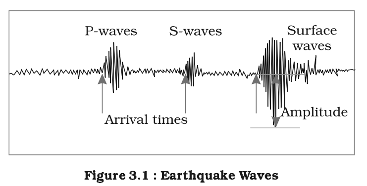
  - 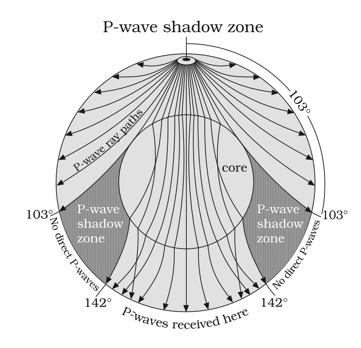
  - 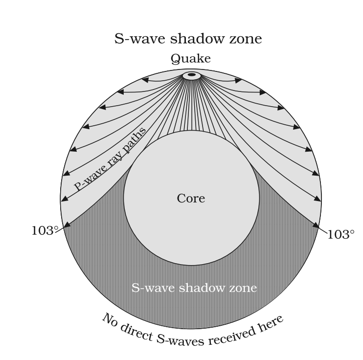
- *Body:*
  - $\color{#7be382}{\text{\textbf{Primary Waves (P-waves)}}}$: Longitudinal waves that travel through all mediums (solids, liquids, gases) — *Example: Their speed increase in the mantle suggests higher density.*
  - $\color{#7be382}{\text{\textbf{Secondary Waves (S-waves)}}}$: Transverse waves that only travel through solids — *Example: Their disappearance at the outer core proves it is liquid.*
  - $\color{#7be382}{\text{\textbf{Shadow Zones}}}$: Areas where waves are not detected due to refraction — *Example: The P-wave shadow zone (103°-142°) helps define core size.*
  - $\color{#7be382}{\text{\textbf{Velocity Variations}}}$: Changes in wave speed indicate structural boundaries — *Example: The Mohorovičić discontinuity (Moho) where waves accelerate entering the mantle.*
  - $\color{#7be382}{\text{\textbf{Epicenter Location}}}$: Comparing arrival times of P and S waves at multiple stations — *Example: Triangulation method used by the USGS.*
  - $\color{#7be382}{\text{\textbf{Magnitude Determination}}}$: Wave amplitude helps calculate the energy released — *Example: Measurement on the Richter Scale.*
  - $\color{#7be382}{\text{\textbf{Focal Mechanism}}}$: Analyzing the first motion of waves to determine fault type — *Example: Identifying thrust vs. strike-slip faulting.*
  - $\color{#7be382}{\text{\textbf{Surface Waves (L \& R)}}}$: Slowest waves traveling along the crust causing maximum damage — *Example: Destructive force in the 2023 Turkey-Syria quake.*
  - $\color{#7be382}{\text{\textbf{Lithosphere Mapping}}}$: Surface wave dispersion helps map crustal thickness — *Example: Identifying thick Himalayan crust.*
  - $\color{#7be382}{\text{\textbf{Seismic Tomography}}}$: 3D modeling of mantle structures — *Example: Visualizing subducting slabs under the Andes.*
- *Conclusion:*
  - Mastering seismic wave analysis is crucial for the **Sendai Framework** goals of disaster risk reduction and building resilient infrastructure.

### Q2. How Earthquake occurs ?
- *Intro:*
  - An earthquake is the sudden shaking of the ground caused by the release of accumulated stress in the Earth's lithosphere along fault lines or due to volcanic/human activity.
  - 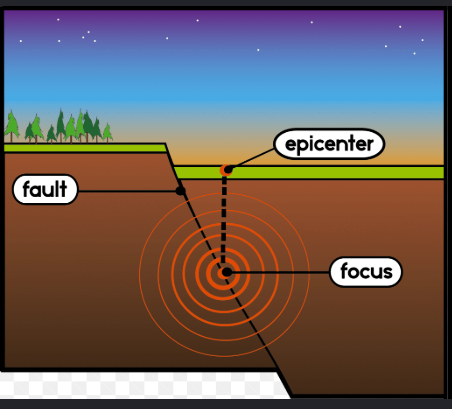
- *Body:*
  - $\color{#7be382}{\text{\textbf{Plate Tectonics}}}$: Relative movement of lithospheric plates creates friction — *Example: Subduction of the Nazca plate under South America.*
  - $\color{#7be382}{\text{\textbf{Elastic Rebound Theory}}}$: Rocks deform elastically until they reach a breaking point and snap — *Example: The 1906 San Francisco earthquake.*
  - $\color{#7be382}{\text{\textbf{Convergent Boundaries}}}$: Collision of plates causes compressional stress — *Example: The 2015 Gorkha (Nepal) earthquake.*
  - $\color{#7be382}{\text{\textbf{Divergent Boundaries}}}$: Tensional stress as plates pull apart — *Example: Frequent quakes along the Mid-Atlantic Ridge.*
  - $\color{#7be382}{\text{\textbf{Transform Faults}}}$: Shear stress from lateral sliding — *Example: Activity along the San Andreas Fault.*
  - $\color{#7be382}{\text{\textbf{Volcanic Eruptions}}}$: Movement of magma creates harmonic tremors — *Example: Premonitory quakes before Mount St. Helens eruption.*
  - $\color{#7be382}{\text{\textbf{Isostatic Adjustment}}}$: Crustal rebounding after the removal of heavy ice/sediments — *Example: Quakes in Scandinavia.*
  - $\color{#7be382}{\text{\textbf{Reservoir Induced Seismicity (RIS)}}}$: Weight of water in large dams triggers quakes — *Example: The 1967 Koyna earthquake in India.*
  - $\color{#7be382}{\text{\textbf{Human Activity}}}$: Fracking, mining, and nuclear tests — *Example: Induced seismicity in Oklahoma, USA.*
  - $\color{#7be382}{\text{\textbf{Fault Reactivation}}}$: Sudden movement along ancient, stable fault lines — *Example: New Madrid Seismic Zone activity.*
- *Conclusion:*
  - Monitoring tectonic stress and historical fault behavior is essential for early warning, especially in high-risk zones like the **Himalayan belt**.

### Q3. What are the impacts of earthquakes ?
- *Intro:*
  - Earthquakes are high-magnitude disasters that cause immediate physical destruction and long-term socio-economic disruptions to human life.
- *Body:*
  - $\color{#7be382}{\text{\textbf{Loss of Life}}}$: Massive mortality due to structural collapses — *Example: Over 50,000 deaths in the 2023 Turkey-Syria earthquake.*
  - $\color{#7be382}{\text{\textbf{Structural Damage}}}$: Destruction of buildings, bridges, and monuments — *Example: Collapse of heritage sites in Kathmandu (2015).*
  - $\color{#7be382}{\text{\textbf{Tsunamis}}}$: Undersea quakes displace huge water columns — *Example: The 2004 Indian Ocean Tsunami.*
  - $\color{#7be382}{\text{\textbf{Soil Liquefaction}}}$: Saturated soil loses strength and behaves like liquid — *Example: Sinking buildings in Niigata, Japan (1964).*
  - $\color{#7be382}{\text{\textbf{Landslides}}}$: Shaking destabilizes mountain slopes — *Example: Landslides blocking rivers after the 2005 Kashmir quake.*
  - $\color{#7be382}{\text{\textbf{Fires}}}$: Rupture of gas lines and electrical short circuits — *Example: Post-quake fires in the 1906 San Francisco quake.*
  - $\color{#7be382}{\text{\textbf{Topographic Change}}}$: Permanent lifting or sinking of the crust — *Example: Land uplift during the 1964 Alaska earthquake.*
  - $\color{#7be382}{\text{\textbf{Infrastructure Paralysis}}}$: Damage to power, water, and communication grids — *Example: Massive blackout after the 2011 Tohoku quake.*
  - $\color{#7be382}{\text{\textbf{Economic Loss}}}$: Billions in reconstruction costs and lost productivity — *Example: The 2011 Japan quake cost ~$235 billion.*
  - $\color{#7be382}{\text{\textbf{Displacement}}}$: Mass migration and homelessness — *Example: Displacement of millions in Haiti (2010).*
- *Conclusion:*
  - Integrated disaster management is vital to achieve **SDG 11**, ensuring human settlements are safe and resilient to seismic shocks.

### Q4. What measures can be taken to mitigate the devastations caused by earthquakes ?
- *Intro:*
  - Earthquake mitigation involves proactive measures to reduce vulnerability through structural engineering, legal frameworks, and community preparedness.
- *Body:*
  - $\color{#7be382}{\text{\textbf{Seismic Zonation}}}$: Mapping areas based on risk levels — *Example: India's division into Zones II to V by BIS.*
  - $\color{#7be382}{\text{\textbf{Building Codes}}}$: Enforcing earthquake-resistant design — *Example: Use of base isolators in Japanese skyscrapers.* 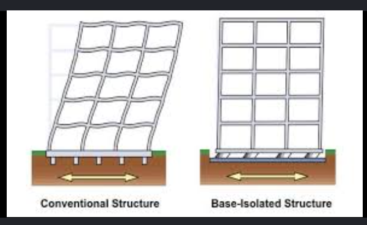
  - $\color{#7be382}{\text{\textbf{Retrofitting}}}$: Strengthening existing old buildings — *Example: Reinforcing schools in California.*
  - $\color{#7be382}{\text{\textbf{Early Warning Systems (EEW)}}}$: Detecting P-waves to provide seconds of notice — *Example: Japan's "J-Alert" system.*
  - $\color{#7be382}{\text{\textbf{Land-use Planning}}}$: Avoiding construction in high-risk liquefaction or fault zones — *Example: Strict zoning in San Francisco.*
  - $\color{#7be382}{\text{\textbf{Community Awareness}}}$: Conduct regular mock drills (Drop, Cover, Hold) — *Example: Annual drills in Tokyo schools.*
  - $\color{#7be382}{\text{\textbf{Institutional Framework}}}$: Empowering agencies for rescue and relief — *Example: Role of the NDRF in India.*
  - $\color{#7be382}{\text{\textbf{Remote Sensing}}}$: Using satellites for post-disaster damage assessment — *Example: ISRO's Bhuvan portal usage.*
  - $\color{#7be382}{\text{\textbf{Public Insurance}}}$: Financial protection for property damage — *Example: The Turkish Catastrophe Insurance Pool.*
  - $\color{#7be382}{\text{\textbf{International Cooperation}}}$: Shared technology and search-rescue teams — *Example: "Operation Dost" by India in Turkey (2023).*
- *Conclusion:*
  - Adherence to the **Sendai Framework** is key to shifting focus from "reactive relief" to "proactive mitigation" for global safety.

### Q5. Discuss on global distribution of earthquakes.
- *Intro:*
  - Earthquakes are not randomly distributed; they primarily occur along tectonic plate boundaries where internal energy is released.
  - 
- *Body:*
  - $\color{#7be382}{\text{\textbf{Circum-Pacific Belt}}}$: Also known as the "Ring of Fire," accounts for 81% of quakes — *Example: High activity in Japan and Chile.*
  - $\color{#7be382}{\text{\textbf{Alpide Belt}}}$: Extends from the Alps through the Himalayas to Indonesia — *Example: The 2015 Nepal earthquake.*
  - $\color{#7be382}{\text{\textbf{Mid-Atlantic Ridge}}}$: Submarine belt of divergent boundaries — *Example: Earthquakes in Iceland.*
  - $\color{#7be382}{\text{\textbf{Mid-Continental Belt}}}$: High stress areas within continents — *Example: Tianshan and Altai mountains.*
  - $\color{#7be382}{\text{\textbf{East African Rift}}}$: Developing divergent boundary — *Example: Seismicity in Ethiopia and Kenya.*
  - $\color{#7be382}{\text{\textbf{Hotspots}}}$: Quakes related to mantle plumes far from boundaries — *Example: Volcanic quakes in Hawaii.*
  - $\color{#7be382}{\text{\textbf{Intra-plate Regions}}}$: Quakes in stable shields due to local stresses — *Example: Latur (India) or New Madrid (USA).*
  - $\color{#7be382}{\text{\textbf{Benioff Zone}}}$: Deep-focus quakes in subduction zones — *Example: Deep quakes near the Tonga Trench.*
  - $\color{#7be382}{\text{\textbf{Transform Faults}}}$: Shallow-focus quakes along sliding plates — *Example: San Andreas Fault system.*
  - $\color{#7be382}{\text{\textbf{Oceanic Trenches}}}$: Areas of intense seismic activity due to subduction — *Example: Mariana Trench region.*
- *Conclusion:*
  - Global monitoring via the **Global Seismographic Network (GSN)** is essential to track these zones and provide warnings for trans-boundary disasters like tsunamis.

### Q6. Discuss on the Indian distribution of earthquakes.
- *Intro:*
  - India's seismic vulnerability is largely dictated by the northward movement of the Indian plate and its collision with the Eurasian plate.
  - 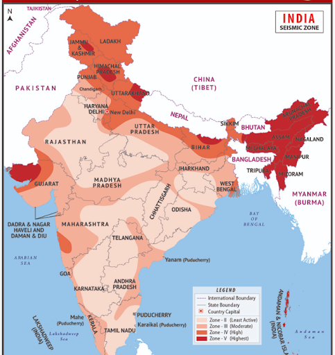
- *Body:*
  - $\color{#7be382}{\text{\textbf{Himalayan Belt (Zone V)}}}$: The most active zone due to plate collision — *Example: Kashmir, Himachal Pradesh, and Uttarakhand.*
  - $\color{#7be382}{\text{\textbf{North-East India}}}$: Extremely high risk due to complex fault systems — *Example: The 1950 Assam-Tibet earthquake.*
  - $\color{#7be382}{\text{\textbf{Indo-Gangetic Plains}}}$: High risk (Zone IV) due to deep sediment amplifying waves — *Example: The 1934 Bihar-Nepal earthquake.*
  - $\color{#7be382}{\text{\textbf{Rann of Kutch}}}$: High seismicity in an intra-plate setting — *Example: The devastating 2001 Bhuj earthquake.*
  - $\color{#7be382}{\text{\textbf{Andaman and Nicobar}}}$: Active subduction zone — *Example: Source of the 2004 Tsunami-triggering quake.*
  - $\color{#7be382}{\text{\textbf{Deccan Plateau}}}$: Traditionally "stable" but showing intra-plate stress — *Example: The 1993 Latur earthquake.*
  - $\color{#7be382}{\text{\textbf{Koyna Region}}}$: Seismic activity linked to reservoir weight — *Example: Ongoing tremors near Koyna Dam.*
  - $\color{#7be382}{\text{\textbf{Western Ghats}}}$: Low to moderate risk (Zone III) — *Example: Tremors in Maharashtra and Kerala.*
  - $\color{#7be382}{\text{\textbf{Eastern Ghats}}}$: Relatively stable Zone II region — *Example: Parts of Odisha and Andhra Pradesh.*
  - $\color{#7be382}{\text{\textbf{Delhi-NCR}}}$: Vulnerable due to proximity to Himalayan faults and local ridges — *Example: Frequent mild tremors in the capital.*
- *Conclusion:*
  - India's updated **IS 1893:2016** zonation map serves as the baseline for the National Earthquake Risk Mitigation Project (NERMP).

### Q7. How Volcanoes are formed ?
- *Intro:*
  - A volcano is formed when magma from the Earth's mantle breaks through the crust, often driven by tectonic movements or mantle plumes.
  - 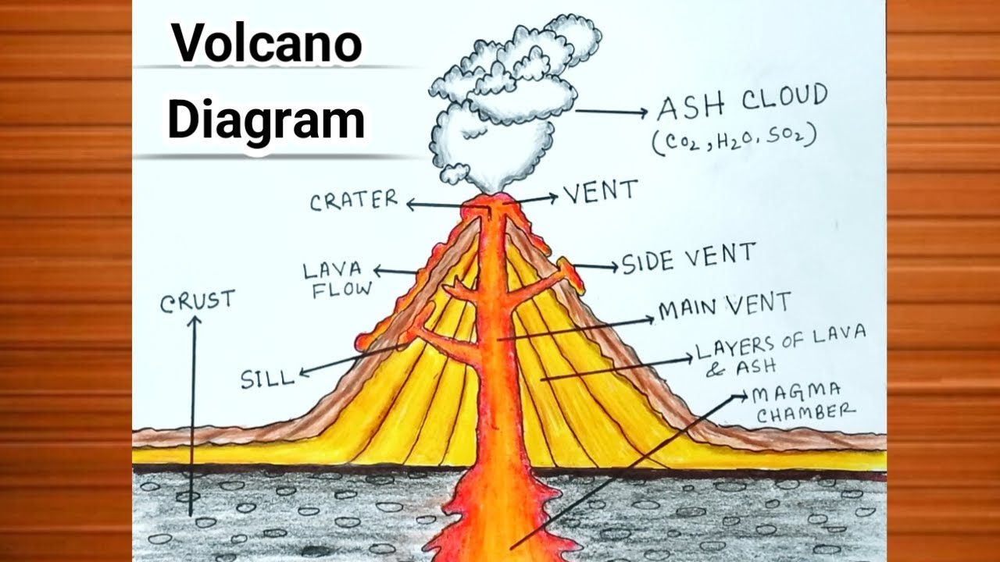
- *Body:*
  - $\color{#7be382}{\text{\textbf{Subduction Zones}}}$: Oceanic plate sinks, melts, and rises as magma — *Example: Mount Fuji in Japan.*
  - $\color{#7be382}{\text{\textbf{Sea-floor Spreading}}}$: Magma rises to fill gaps as plates pull apart — *Example: Mid-Atlantic Ridge.*
  - $\color{#7be382}{\text{\textbf{Continental Rifting}}}$: Stretching of continental crust allows magma ascent — *Example: Mount Kilimanjaro in East Africa.*
  - $\color{#7be382}{\text{\textbf{Hotspots}}}$: Stationary mantle plumes melt the overriding plate — *Example: The Hawaiian Islands.*
  - $\color{#7be382}{\text{\textbf{Flux Melting}}}$: Water from subducting plates lowers mantle melting point — *Example: Volcanoes of the Andes.*
  - $\color{#7be382}{\text{\textbf{Decompression Melting}}}$: Upwelling mantle melts due to pressure drop — *Example: Eruptions in Iceland.*
  - $\color{#7be382}{\text{\textbf{Magma Chambers}}}$: Reservoirs where magma collects before eruption — *Example: Huge chamber under Yellowstone Caldera.*
  - $\color{#7be382}{\text{\textbf{Differentiated Viscosity}}}$: Silica content determines if volcano is explosive or quiet — *Example: Effusive Mauna Loa vs. Explosive Mt. Pinatubo.*
  - $\color{#7be382}{\text{\textbf{Crustal Fractures}}}$: Faults provide easy pathways for magma — *Example: Fissure eruptions in Iceland (2024).*
  - $\color{#7be382}{\text{\textbf{Isostatic Rebound}}}$: Melting glaciers can trigger eruptions by reducing pressure — *Example: Volcanic activity in Iceland.*
- *Conclusion:*
  - The **2024 eruptions in Grindavik, Iceland**, demonstrate the continuous nature of volcanic formation at divergent boundaries.

### Q8. What are the impacts of volcanic eruptions ?
- *Intro:*
  - Volcanic eruptions are powerful geological events that cause short-term devastation and long-term changes to the Earth's environment.
  - 
- *Body:*
  - $\color{#7be382}{\text{\textbf{Lava Flows}}}$: Destroys everything in its path through heat — *Example: Destruction of homes in La Palma (2021).*
  - $\color{#7be382}{\text{\textbf{Pyroclastic Flows}}}$: Rapid, hot gas and ash clouds that are lethal — *Example: Burial of Pompeii by Mt. Vesuvius.*
  - $\color{#7be382}{\text{\textbf{Lahars}}}$: Volcanic mudflows triggered by rain or ice melt — *Example: The Nevado del Ruiz tragedy (1985).*
  - $\color{#7be382}{\text{\textbf{Ash Fall}}}$: Damages crops, clogs engines, and causes respiratory issues — *Example: Air travel disruption after Eyjafjallajökull (2010).*
  - $\color{#7be382}{\text{\textbf{Global Cooling}}}$: Sulfur dioxide aerosols reflect sunlight — *Example: "Year Without a Summer" after Mt. Tambora (1815).*
  - $\color{#7be382}{\text{\textbf{Acid Rain}}}$: Volcanic gases mix with atmospheric moisture — *Example: Damage to forests near Mt. Etna.*
  - $\color{#7be382}{\text{\textbf{Soil Fertility}}}$: Volcanic ash provides rich minerals for long-term farming — *Example: Fertile lands of the Deccan Traps or Java.*
  - $\color{#7be382}{\text{\textbf{Geothermal Energy}}}$: Volcanic heat used for power generation — *Example: 25% of Iceland's electricity.*
  - $\color{#7be382}{\text{\textbf{New Land Formation}}}$: Lava cooling in oceans creates islands — *Example: Surtsey Island, Iceland.*
  - $\color{#7be382}{\text{\textbf{Tsunamis}}}$: Volcanic collapse into the sea triggers waves — *Example: The 2022 Hunga Tonga-Hunga Ha'apai eruption.*
- *Conclusion:*
  - Volcanic eruptions highlight the necessity of robust disaster management under the **Sendai Framework**. While recent events like the **2024 Reykjanes (Iceland) eruptions** cause significant local disruption, their long-term role in fostering fertile soils and geothermal power remains a critical asset for achieving **SDG 2 (Zero Hunger)** and **SDG 7 (Affordable and Clean Energy)**.

### Q9. How can we mitigate the devastations caused by volcanic eruptions ?
- *Intro:*
  - Volcanic mitigation involves a combination of real-time monitoring, hazard mapping, and effective evacuation strategies to minimize loss.
- *Body:*
  - $\color{#7be382}{\text{\textbf{Seismic Monitoring}}}$: Tracking tremors that signal magma movement — *Example: Used effectively by the USGS at Mt. St. Helens.*
  - $\color{#7be382}{\text{\textbf{Hazard Mapping}}}$: Identifying high-risk areas for lava and lahars — *Example: Zonation around Mt. Rainier.*
  - $\color{#7be382}{\text{\textbf{Gas Monitoring}}}$: Detecting changes in SO2 and CO2 levels — *Example: Monitoring at Mt. Etna.*
  - $\color{#7be382}{\text{\textbf{Satellite InSAR}}}$: Measuring ground swelling (inflation) from space — *Example: Used for the 2024 Iceland eruptions.*
  - $\color{#7be382}{\text{\textbf{Evacuation Drills}}}$: Training communities to respond quickly — *Example: Regular drills in the shadow of Mt. Sakurajima, Japan.*
  - $\color{#7be382}{\text{\textbf{Lava Diversion}}}$: Using barriers or water to change lava direction — *Example: Successful cooling of lava in Heimaey, Iceland (1973).*
  - $\color{#7be382}{\text{\textbf{Public Education}}}$: Distributing ash masks and safety manuals — *Example: Programs in the Philippines for Mt. Mayon.*
  - $\color{#7be382}{\text{\textbf{Real-time Alerts}}}$: Color-coded warning systems for aviation — *Example: ICAO's volcanic ash advisories.*
  - $\color{#7be382}{\text{\textbf{Automatic Shutdowns}}}$: Sensors to cut power and gas in eruption zones — *Example: Smart grids in volcanic regions.*
  - $\color{#7be382}{\text{\textbf{Re-forestation}}}$: Stabilizing slopes to prevent lahars — *Example: Buffer zones in Indonesia.*
- *Conclusion:*
  - The **Global Volcanism Program** by the Smithsonian facilitates international data sharing to protect lives from unpredictable eruptions.

### Q10. Discuss on the global distribution of active volcanoes.
- *Intro:*
  - Most active volcanoes are concentrated along plate margins, specifically where subduction or rifting occurs.
  - 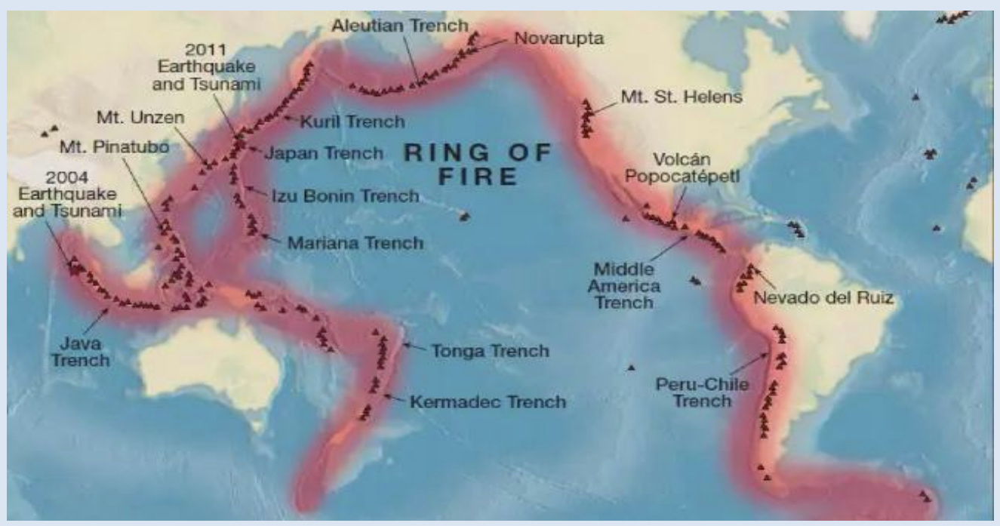
  - 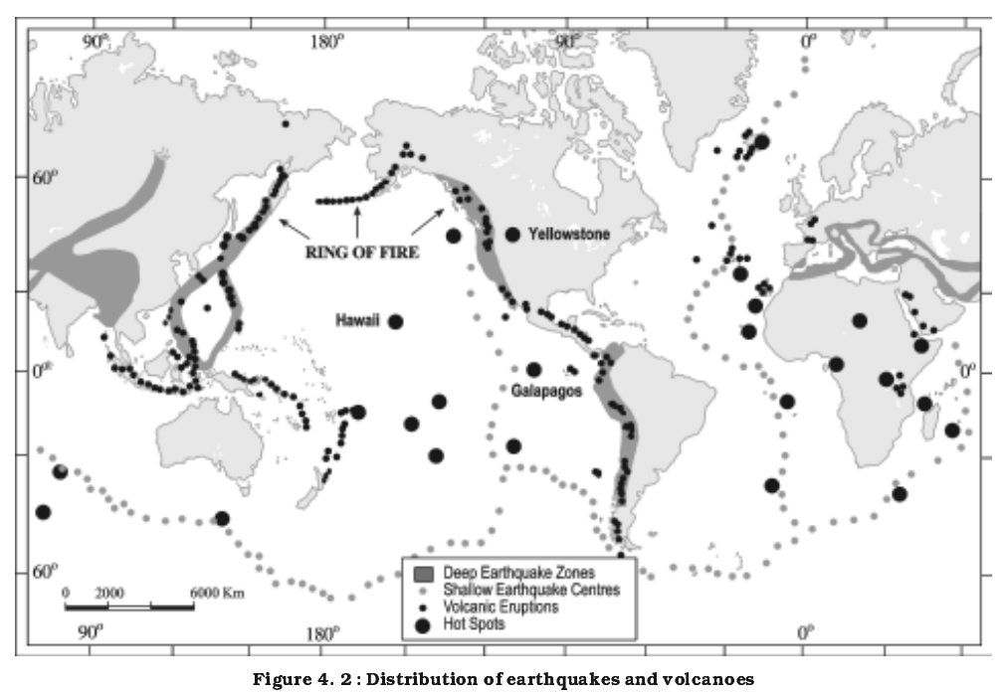
- *Body:*
  - $\color{#7be382}{\text{\textbf{Circum-Pacific Belt}}}$: The "Ring of Fire" contains 75% of active volcanoes — *Example: Mt. Merapi, Mt. St. Helens.*
  - $\color{#7be382}{\text{\textbf{Mid-Atlantic Ridge}}}$: Submerged belt with islands formed by volcanism — *Example: Iceland (active) and Azores.*
  - $\color{#7be382}{\text{\textbf{Alpide Belt}}}$: Includes the Mediterranean and Indonesian volcanoes — *Example: Mt. Vesuvius and Mt. Etna.*
  - $\color{#7be382}{\text{\textbf{East African Rift}}}$: Area of continental break-up — *Example: Ol Doinyo Lengai and Mt. Nyiragongo.*
  - $\color{#7be382}{\text{\textbf{Hawaiian Hotspot}}}$: Chain of shield volcanoes in the middle of the Pacific — *Example: Mauna Loa.*
  - $\color{#7be382}{\text{\textbf{Réunion Hotspot}}}$: Located in the Indian Ocean — *Example: Piton de la Fournaise.*
  - $\color{#7be382}{\text{\textbf{Antarctic Belt}}}$: Volcanism on the frozen continent — *Example: Mt. Erebus.*
  - $\color{#7be382}{\text{\textbf{Indo-Burma Arc}}}$: India's only active volcano — *Example: Barren Island.*
  - $\color{#7be382}{\text{\textbf{Andean Volcanic Belt}}}$: Continental arc due to subduction — *Example: Cotopaxi in Ecuador.*
  - $\color{#7be382}{\text{\textbf{Icelandic Plateau}}}$: Intersection of a ridge and a hotspot — *Example: The Reykjanes Peninsula.*
- *Conclusion:*
  - Understanding this distribution is vital for global aviation safety, managed through **Volcanic Ash Advisory Centers (VAACs)**.

### Q11. Discuss on the landforms caused due to volcanic eruptions.
- *Intro:*
  - Volcanic activity creates diverse landforms categorized into Extrusive (surface) and Intrusive (sub-surface/plutonic) features.
  - 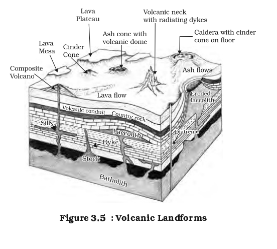
- *Body:*
  - $\color{#7be382}{\text{\textbf{Shield Volcanoes}}}$: Broad, low-profile cones from fluid basaltic lava — *Example: Mauna Loa, Hawaii.*
  - $\color{#7be382}{\text{\textbf{Composite Cones (Stratovolcanoes)}}}$: Tall, layered peaks from viscous lava — *Example: Mt. Fuji, Japan.*
  - $\color{#7be382}{\text{\textbf{Calderas}}}$: Massive depressions formed by collapsed magma chambers — *Example: Crater Lake, USA.*
  - $\color{#7be382}{\text{\textbf{Flood Basalt Provinces}}}$: Vast plains created by fissure eruptions — *Example: Deccan Traps, India.*
  - $\color{#7be382}{\text{\textbf{Cinder Cones}}}$: Small, steep hills made of volcanic fragments — *Example: Parícutin, Mexico.*
  - $\color{#7be382}{\text{\textbf{Batholiths}}}$: Large, deep-seated masses of cooled magma — *Example: Granite cores of the Sierra Nevada.*
  - $\color{#7be382}{\text{\textbf{Laccoliths}}}$: Dome-shaped intrusive landforms that push up the crust — *Example: Henry Mountains, Utah.*
  - $\color{#7be382}{\text{\textbf{Sills}}}$: Horizontal sheets of magma injected between rock layers — *Example: Salisbury Crags, Scotland.*
  - $\color{#7be382}{\text{\textbf{Dykes}}}$: Vertical or near-vertical magma sheets cutting across layers — *Example: Shiprock, New Mexico.*
  - $\color{#7be382}{\text{\textbf{Phacoliths}}}$: Magma collected in the crest or trough of a fold.
  - $\color{#7be382}{\text{\textbf{Lopoliths}}}$: Saucer-shaped intrusive bodies.
- *Conclusion:*
  - Volcanic landforms are fundamental to Earth's geology, providing valuable mineral resources (e.g., Kimberlite pipes for diamonds) and creating unique, often spectacular, landscapes, with many such regions, like the **Hawaii Volcanoes National Park**, celebrated as **UNESCO World Heritage** sites for their exceptional geological and ecological significance.

### Q12. Why majority of earthquakes and volcanic eruptions mostly occur at the ring of fire ?
- *Intro:*
  - The Ring of Fire is a 40,000 km horseshoe-shaped zone around the Pacific Ocean where over 90% of earthquakes and 75% of active volcanoes occur due to intense plate tectonic activity.
  - 
- *Body:*
  - $\color{#7be382}{\text{\textbf{Convergent Plate Boundaries}}}$: The Ring of Fire is predominantly characterized by multiple convergent plate boundaries where oceanic plates collide with continental or other oceanic plates.
  - $\color{#7be382}{\text{\textbf{Subduction Zones}}}$: These convergent boundaries involve the subduction of oceanic lithosphere beneath another plate, a primary driver of both volcanism and seismicity — *Example: The subduction of the Pacific Plate under the North American Plate.*
  - $\color{#7be382}{\text{\textbf{Flux Melting}}}$: Water and volatiles carried by the subducting oceanic crust lower the melting point of the overlying mantle wedge, generating magma — *Example: The formation of magma beneath the Andes Mountains.*
  - $\color{#7be382}{\text{\textbf{Viscous Magma}}}$: The magma generated in subduction zones is typically silica-rich and viscous, leading to explosive volcanic eruptions — *Example: The eruption style of Mount St. Helens.*
  - $\color{#7be382}{\text{\textbf{Island Arcs}}}$: Where oceanic crust subducts beneath another oceanic plate, chains of volcanic islands form — *Example: The Japanese Archipelago.*
  - $\color{#7be382}{\text{\textbf{Continental Volcanic Arcs}}}$: Where oceanic crust subducts beneath continental crust, volcanic mountain ranges form on the continent — *Example: The Cascade Range in North America.*
  - $\color{#7be382}{\text{\textbf{Deep Ocean Trenches}}}$: These are the deepest parts of the ocean, formed at subduction zones, and are sites of intense seismic activity — *Example: The Mariana Trench.*
  - $\color{#7be382}{\text{\textbf{Benioff Zones}}}$: Earthquakes occur along these inclined planes of subduction, extending deep into the mantle — *Example: Deep-focus earthquakes near the Tonga Trench.*
  - $\color{#7be382}{\text{\textbf{High Crustal Stress}}}$: The constant grinding and collision of plates accumulate immense stress, which is periodically released as earthquakes — *Example: The frequent large earthquakes along the Chilean coast.*
  - $\color{#7be382}{\text{\textbf{Rapid Plate Movement}}}$: The Pacific Plate is one of the fastest-moving plates, increasing the frequency and intensity of tectonic interactions — *Example: Movement rates of 7-11 cm/year.*
  - $\color{#7be382}{\text{\textbf{Transform Faults}}}$: While less dominant than convergent boundaries, some segments involve plates sliding past each other, generating shallow, powerful earthquakes — *Example: The Queen Charlotte Fault off the coast of British Columbia.*
  - $\color{#7be382}{\text{\textbf{Accretionary Wedges}}}$: Sediments scraped off the subducting plate accumulate to form these seismically active zones — *Example: The accretionary prism off the coast of Alaska.*
  - $\color{#7be382}{\text{\textbf{Back-arc Basins}}}$: Tensional forces behind some volcanic arcs can lead to the formation of new oceanic crust and associated seismic/volcanic activity — *Example: The Sea of Japan.*
  - $\color{#7be382}{\text{\textbf{Complex Fault Systems}}}$: The region is characterized by a dense network of various types of faults (thrust, normal, strike-slip) accommodating the complex stress field — *Example: The numerous fault lines across California.*
  - $\color{#7be382}{\text{\textbf{Global Tectonic Interconnection}}}$: The Ring of Fire is not isolated; its activity is interconnected with the dynamics of other major plates, making it a critical global seismic and volcanic engine — *Example: The influence of the Australian Plate's northward movement on Indonesian volcanism.*
- *Conclusion:*
  - The Ring of Fire is the Earth's most dynamic laboratory, significantly influencing global climate and disaster management strategies.

### Q13. What is continental drift theory ? How can we claim this theory to be true ?
- *Intro:*
  - Proposed by Alfred Wegener (1912), the theory suggests that all continents were once part of a single landmass called "Pangea" that drifted apart over millions of years.
  - 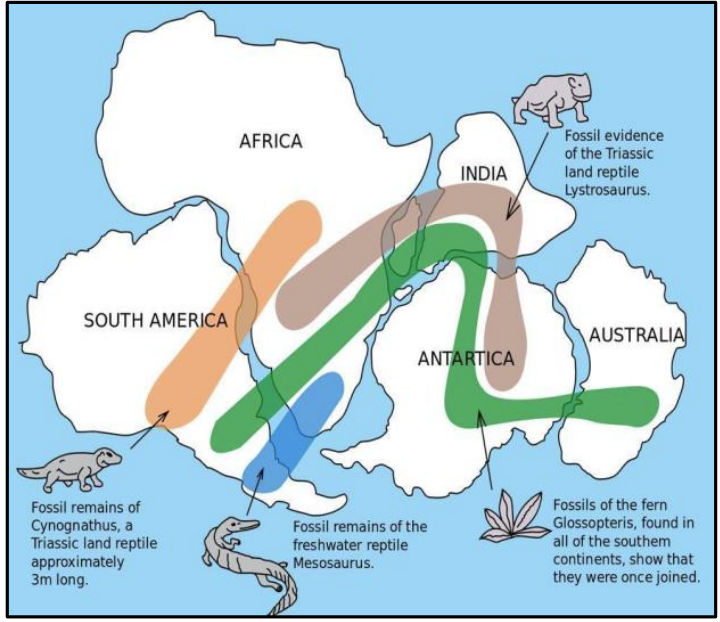
- *Body:*
  - $\color{#7be382}{\text{\textbf{Jigsaw Fit}}}$: The coastlines of South America and Africa match perfectly — *Example: Brazil fitting into the Gulf of Guinea.*
  - $\color{#7be382}{\text{\textbf{Fossil Evidence}}}$: Identical fossils found on continents separated by oceans — *Example: Mesosaurus fossils in South America and Africa.*
  - $\color{#7be382}{\text{\textbf{Glossopteris Flora}}}$: Ancient fern fossils found in all southern continents and India.
  - $\color{#7be382}{\text{\textbf{Geological Continuity}}}$: Rock types and mountain ranges match across oceans — *Example: Appalachians (USA) matching the Caledonian mountains (UK).*
  - $\color{#7be382}{\text{\textbf{Paleoclimatic Evidence}}}$: Glacial deposits found in tropical India and Africa — *Example: Tillite deposits in Gondwana rock systems.*
  - $\color{#7be382}{\text{\textbf{Placer Deposits}}}$: Gold in Ghana with source rocks located in Brazil — *Example: The "Gold Coast" phenomenon.*
  - $\color{#7be382}{\text{\textbf{Polar Wandering}}}$: Apparent movement of magnetic poles relative to fixed continents.
  - $\color{#7be382}{\text{\textbf{Paleomagnetism}}}$: Magnetic signatures in rocks proving they formed at different latitudes.
  - $\color{#7be382}{\text{\textbf{Sea-floor Spreading}}}$: Mid-ocean ridges creating new crust, pushing continents away — *Example: Growth of the Atlantic Ocean.*
  - $\color{#7be382}{\text{\textbf{GPS Measurements}}}$: Satellite data confirming continents move by centimeters every year.
- *Conclusion:*
  - While Wegener couldn't explain the mechanism, his evidence led to the modern **Plate Tectonic Theory**, revolutionizing our understanding of Earth.

### Q14. What is plate tectonic theory ?
- *Intro:*
  - Plate Tectonics is a comprehensive theory that describes the large-scale motion of seven major and several minor lithospheric plates over the ductile asthenosphere.
  - 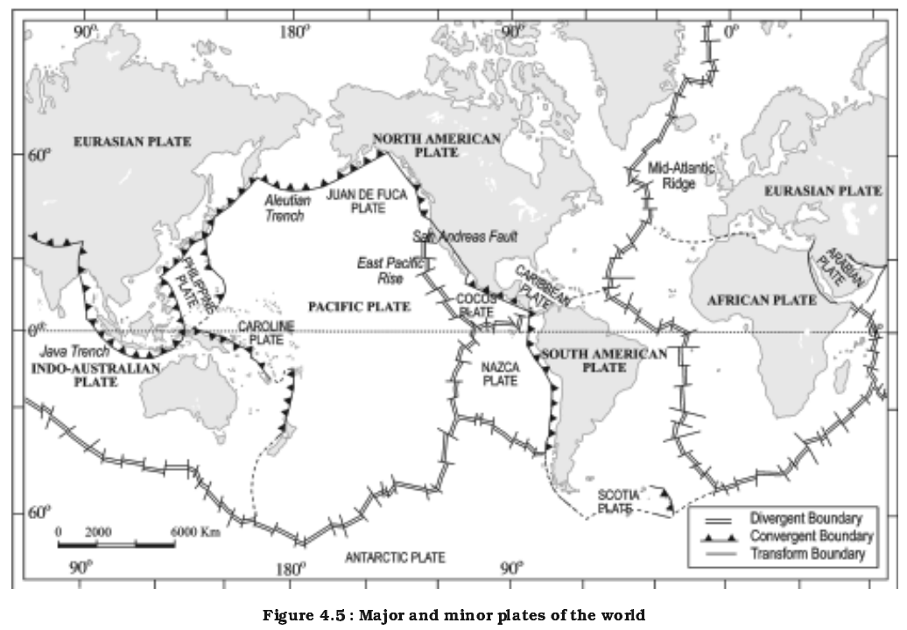
- *Body:*
  - *Body:*
  - $\color{#7be382}{\text{\textbf{Lithospheric Plates}}}$: Earth's rigid outer shell, comprising the crust and uppermost mantle, is divided into numerous fragments — *Example: The Pacific Plate and the Eurasian Plate.*
  - $\color{#7be382}{\text{\textbf{Types of Plates}}}$: Plates are either oceanic (denser, basaltic) or continental (less dense, granitic), or a combination of both — *Example: The Nazca Plate is oceanic, while the African Plate is a mix.*
  - $\color{#7be382}{\text{\textbf{Asthenosphere}}}$: These rigid plates float and move slowly over a semi-fluid, ductile layer of the upper mantle, enabling their motion.
  - $\color{#7be382}{\text{\textbf{Convection Currents}}}$: Heat from the Earth's core and mantle creates slow-moving convection cells within the asthenosphere, acting as a conveyor belt for the plates — *Example: Hot, less dense material rises, spreads, cools, and then sinks.*
  - $\color{#7be382}{\text{\textbf{Ridge Push}}}$: Gravitational force acting on the elevated mid-ocean ridges pushes plates away from the ridge crests — *Example: The Mid-Atlantic Ridge pushing the North American and Eurasian plates apart.*
  - $\color{#7be382}{\text{\textbf{Slab Pull}}}$: The primary driving force, where the dense, cold, subducting oceanic plate pulls the rest of the plate into the mantle due to its weight — *Example: The Pacific Plate pulling the Juan de Fuca Plate beneath North America.*
  - $\color{#7be382}{\text{\textbf{Divergent Boundaries}}}$: Plates move apart, leading to the upwelling of magma and the creation of new crustal material — *Example: The formation of the Great Rift Valley in East Africa.*
  - $\color{#7be382}{\text{\textbf{Convergent Boundaries}}}$: Plates collide, resulting in subduction (one plate sliding under another), mountain building, or crustal shortening — *Example: The ongoing collision of the Indian and Eurasian plates forming the Himalayas.*
  - $\color{#7be382}{\text{\textbf{Transform Boundaries}}}$: Plates slide horizontally past each other, causing frequent shallow earthquakes but little crustal creation or destruction — *Example: The San Andreas Fault in California.*
  - $\color{#7be382}{\text{\textbf{Seven Major Plates}}}$: The largest plates include the Pacific, North American, South American, Eurasian, African, Indo-Australian, and Antarctic plates.
  - $\color{#7be382}{\text{\textbf{Minor Plates}}}$: Numerous smaller plates also exist, contributing to regional tectonic activity — *Example: The Nazca Plate, Arabian Plate, Philippine Sea Plate.*
  - $\color{#7be382}{\text{\textbf{Rates of Movement}}}$: Plates move at speeds comparable to human fingernail growth, typically ranging from 1 to 10 centimeters per year — *Example: The Pacific Plate moves at approximately 7-11 cm/year.*
  - $\color{#7be382}{\text{\textbf{Paleomagnetism}}}$: Magnetic stripes on the seafloor, symmetrical around mid-ocean ridges, provide conclusive evidence of past plate movement and seafloor spreading — *Example: Reversals of Earth's magnetic field recorded in oceanic crust.*
  - $\color{#7be382}{\text{\textbf{Hotspots}}}$: Volcanic activity occurring far from plate boundaries, caused by stationary mantle plumes, which can track plate movement over geological time — *Example: The Hawaiian Island chain formed as the Pacific Plate moved over a stationary hotspot.*
  - $\color{#7be382}{\text{\textbf{Current Movements}}}$: Ongoing processes include the widening of the Atlantic Ocean and the continued uplift of the Himalayas, constantly reshaping Earth's surface — *Example: GPS measurements confirm the northward movement of the Indian Plate, causing Himalayan growth.*
- *Conclusion:*
  - Plate Tectonics is the "Unifying Theory" of geology, explaining everything from mountain building to the distribution of mineral resources.

### Q15. What are the consequences of plate tectonic theory ?
- *Intro:*
  - The movement of tectonic plates results in various geological and biological consequences that have shaped the Earth's history.
  - 
- *Body:*
  - $\color{#7be382}{\text{\textbf{Orogeny}}}$: Formation of massive mountain chains — *Example: The Alps and Himalayas.*
  - $\color{#7be382}{\text{\textbf{Vulcanicity}}}$: Distribution of active volcanoes along plate margins.
  - $\color{#7be382}{\text{\textbf{Seismicity}}}$: Occurrence of earthquakes due to plate interactions.
  - $\color{#7be382}{\text{\textbf{Ocean Basin Evolution}}}$: Creation and destruction of oceans — *Example: The Tethys sea closing to form the Mediterranean.*
  - $\color{#7be382}{\text{\textbf{Resource Distribution}}}$: Metal deposits at boundaries — *Example: Copper in the Andes (subduction zones).*
  - $\color{#7be382}{\text{\textbf{Biological Evolution}}}$: Continental drift isolated species — *Example: Evolution of marsupials in Australia.*
  - $\color{#7be382}{\text{\textbf{Climate Change}}}$: Continental position affects ocean currents and wind patterns — *Example: Opening of the Drake Passage.*
  - $\color{#7be382}{\text{\textbf{Trench Formation}}}$: Deepest parts of the ocean created by subduction.
  - $\color{#7be382}{\text{\textbf{Island Arc Formation}}}$: Archipelagos created by oceanic subduction — *Example: Aleutian Islands.*
  - $\color{#7be382}{\text{\textbf{Rock Cycle}}}$: Continuous recycling of crustal material into the mantle.
- *Conclusion:*
  - Plate tectonics ensures the Earth remains geologically active, which is essential for maintaining the atmosphere and supporting life.

### Q16. How rocks are formed ?
- *Intro:*
  - Rocks are naturally occurring solid aggregates of minerals formed through three primary processes: cooling of magma, sedimentation, or metamorphic transformation.
  - 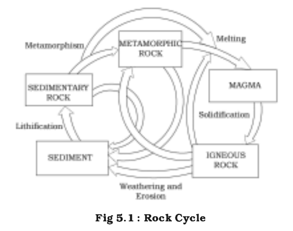
- *Body:*
  - $\color{#7be382}{\text{\textbf{Igneous (Intrusive)}}}$: Magma cools slowly deep underground — *Example: Granite.*
  - $\color{#7be382}{\text{\textbf{Igneous (Extrusive)}}}$: Lava cools rapidly on the surface — *Example: Basalt.*
  - $\color{#7be382}{\text{\textbf{Weathering and Erosion}}}$: Breakdown of existing rocks into sediments by wind/water.
  - $\color{#7be382}{\text{\textbf{Sedimentation}}}$: Deposition of fragments in layers — *Example: Riverbeds or ocean floors.*
  - $\color{#7be382}{\text{\textbf{Lithification}}}$: Compaction and cementation of sediments into rock — *Example: Sandstone.*
  - $\color{#7be382}{\text{\textbf{Organic Formation}}}$: Accumulation of plant or animal remains — *Example: Limestone from shells; Coal from peat.*
  - $\color{#7be382}{\text{\textbf{Chemical Precipitation}}}$: Minerals settling out of water solutions — *Example: Rock salt (Halite).*
  - $\color{#7be382}{\text{\textbf{Contact Metamorphism}}}$: Existing rocks changed by intense heat from nearby magma — *Example: Limestone into Marble.*
  - $\color{#7be382}{\text{\textbf{Regional Metamorphism}}}$: Large-scale transformation by high pressure during mountain building — *Example: Shale into Schist.*
  - $\color{#7be382}{\text{\textbf{Recrystallization}}}$: Minerals change structure without melting under stress.
- *Conclusion:*
  - The **Rock Cycle** demonstrates the eternal recycling of Earth's materials, ensuring a continuous supply of minerals for the ecosystem.

### Q17. What is a landslide ? How they are formed ?
- *Intro:*
  - A landslide is the movement of a mass of rock, debris, or earth down a slope under the direct influence of gravity.
  - 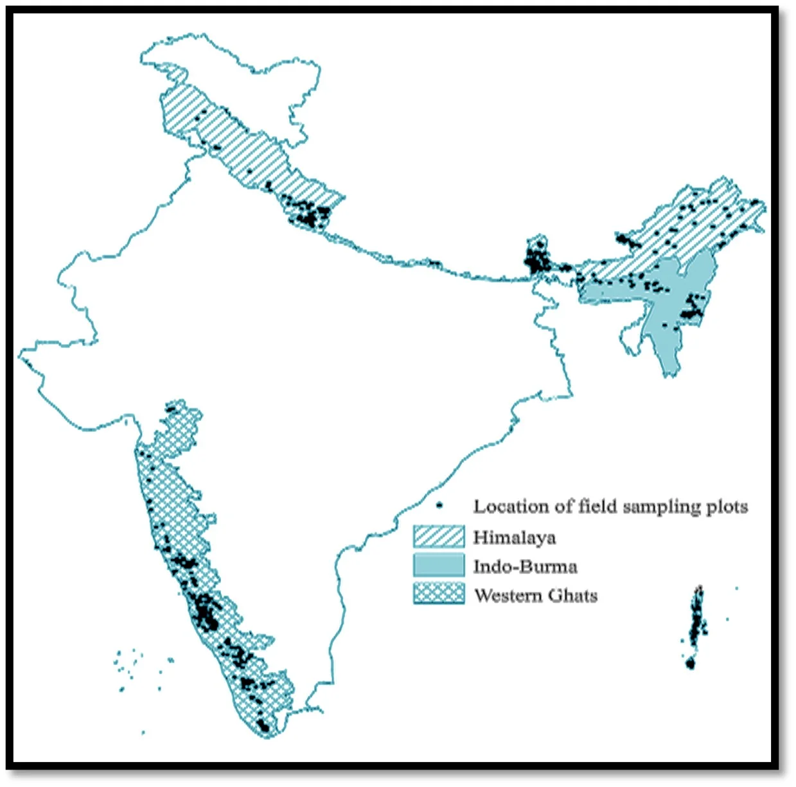
- *Body:*
  - $\color{#7be382}{\text{\textbf{Gravity}}}$: The primary driving force on all slopes.
  - $\color{#7be382}{\text{\textbf{Saturation}}}$: Heavy rainfall adds weight and reduces friction in soil — *Example: Wayanad Landslides (2024).*
  - $\color{#7be382}{\text{\textbf{Seismicity}}}$: Earthquake vibrations loosen rock masses — *Example: Landslides after the 2015 Nepal quake.*
  - $\color{#7be382}{\text{\textbf{Undercutting}}}$: Erosion by rivers or waves at the base of a slope.
  - $\color{#7be382}{\text{\textbf{Deforestation}}}$: Removal of roots that bind the soil together — *Example: Frequent slides in the Western Ghats.*
  - $\color{#7be382}{\text{\textbf{Construction}}}$: Building roads and houses on unstable slopes — *Example: Himalayan highway projects.*
  - $\color{#7be382}{\text{\textbf{Mining/Quarrying}}}$: Use of explosives and removal of slope support.
  - $\color{#7be382}{\text{\textbf{Volcanic Shaking}}}$: Magma movement destabilizing the volcano's flanks.
  - $\color{#7be382}{\text{\textbf{Slope Angle}}}$: Steeper slopes are naturally more prone to failure.
  - $\color{#7be382}{\text{\textbf{Weathering}}}$: Chemical or physical breakdown of rocks weakening their structure.
- *Conclusion:*
  - Landslides are becoming more frequent due to climate-induced heavy rain, making **SDG 15 (Life on Land)** and slope stabilization critical.

### Q18. What are the impacts of landslides ?
- *Intro:*
  - Landslides are destructive mass-wasting events that have severe consequences for infrastructure, the environment, and human life.
  - 
- *Body:*
  - $\color{#7be382}{\text{\textbf{Fatalities}}}$: Direct burial of people and settlements — *Example: Over 400 deaths in Wayanad (2024).*
  - $\color{#7be382}{\text{\textbf{Infrastructure Destruction}}}$: Damage to roads, railways, and bridges — *Example: Blockage of the Konkan Railway.*
  - $\color{#7be382}{\text{\textbf{River Blockage}}}$: Debris creates "landslide dams" leading to flash floods — *Example: The 2021 Rishi Ganga disaster.*
  - $\color{#7be382}{\text{\textbf{Loss of Arable Land}}}$: Topsoil is stripped away, ruining agriculture.
  - $\color{#7be382}{\text{\textbf{Property Damage}}}$: Destruction of homes and commercial buildings.
  - $\color{#7be382}{\text{\textbf{Ecological Disruption}}}$: Destruction of forests and wildlife habitats.
  - $\color{#7be382}{\text{\textbf{Economic Cost}}}$: Huge expenses in debris removal and reconstruction.
  - $\color{#7be382}{\text{\textbf{Sedimentation}}}$: Increased silt in rivers affecting dams and water quality.
  - $\color{#7be382}{\text{\textbf{Psychological Trauma}}}$: Impact on survivors in hill communities.
  - $\color{#7be382}{\text{\textbf{Utility Paralysis}}}$: Severing of power lines and water pipes.
- *Conclusion:*
  - Managing landslide impacts is essential for **SDG 11**, requiring better hazard mapping and early warning in mountainous regions.

### Q19. What are the mitigation steps of landslides ?
- *Intro:*
  - Landslide mitigation involves engineering and biological measures designed to stabilize slopes and protect human settlements.
  - 
- *Body:*
  - $\color{#7be382}{\text{\textbf{Hazard Zonation}}}$: Mapping areas based on risk to restrict construction — *Example: GSI's landslide susceptibility maps.*
  - $\color{#7be382}{\text{\textbf{Afforestation}}}$: Planting deep-rooted trees to bind soil — *Example: Green belts in the Himalayas.*
  - $\color{#7be382}{\text{\textbf{Retaining Walls}}}$: Building concrete or stone structures at the base of slopes.
  - $\color{#7be382}{\text{\textbf{Drainage Control}}}$: Channeling surface and groundwater away from slopes — *Example: Vital in the Nilgiris.*
  - $\color{#7be382}{\text{\textbf{Slope Leveling}}}$: Reducing the gradient through terracing.
  - $\color{#7be382}{\text{\textbf{Early Warning Systems}}}$: Rain gauges and soil moisture sensors to predict slides — *Example: IIT Roorkee's warning systems.*
  - $\color{#7be382}{\text{\textbf{Rock Bolting}}}$: Inserting long steel bolts to anchor unstable rocks.
  - $\color{#7be382}{\text{\textbf{Shotcrete}}}$: Spraying concrete on rock faces to prevent weathering.
  - $\color{#7be382}{\text{\textbf{Gabions}}}$: Using wire cages filled with rocks to provide flexible slope support.
  - $\color{#7be382}{\text{\textbf{Awareness Programs}}}$: Training locals to spot early signs like ground cracks.
- *Conclusion:*
  - Effective landslide mitigation is a key component of the **National Landslide Risk Mitigation Strategy** in India.

### Q20. How soils are formed ?
- *Intro:*
  - Soil formation (Pedogenesis) is a slow process involving the interaction of parent material, climate, organisms, and topography over time.
  - 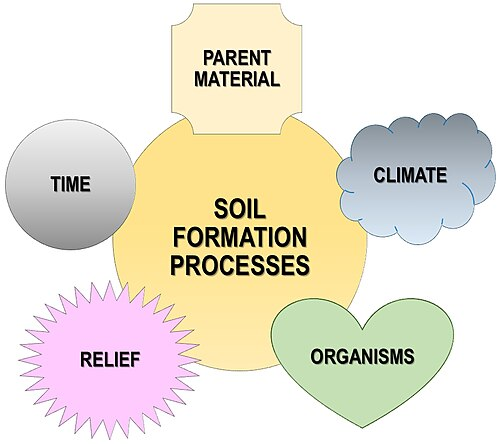
- *Body:*
  - $\color{#7be382}{\text{\textbf{Parent Material}}}$: Determines mineral content and texture — *Example: Basalt rock forming Black Soil.*
  - $\color{#7be382}{\text{\textbf{Physical Weathering}}}$: Breakdown of rocks by temperature change and frost — *Example: Formation of desert sands.*
  - $\color{#7be382}{\text{\textbf{Chemical Weathering}}}$: Oxidation and carbonation changing rock minerals — *Example: Red soil formation.*
  - $\color{#7be382}{\text{\textbf{Climate (Rainfall)}}}$: Facilitates leaching of minerals — *Example: Laterite soil in high-rain areas.*
  - $\color{#7be382}{\text{\textbf{Humification}}}$: Decomposition of organic matter by bacteria/fungi — *Example: Rich humus in forest soils.*
  - $\color{#7be382}{\text{\textbf{Topography}}}$: Steep slopes have thin soil; plains have deep soil — *Example: Thick Alluvial soil in the Indo-Gangetic plains.*
  - $\color{#7be382}{\text{\textbf{Time}}}$: Soil takes centuries to develop a mature profile — *Example: 1 inch of soil can take 500 years.*
  - $\color{#7be382}{\text{\textbf{Biota}}}$: Earthworms and roots aerate the soil and add nutrients.
  - $\color{#7be382}{\text{\textbf{Leaching}}}$: Downward movement of nutrients in wet climates.
  - $\color{#7be382}{\text{\textbf{Calcification}}}$: Accumulation of calcium in arid regions — *Example: Kankar in Khadar/Bhangar.*
- *Conclusion:*
  - Soil is a non-renewable resource essential for **SDG 2 (Zero Hunger)**; its preservation is vital for global food security.
